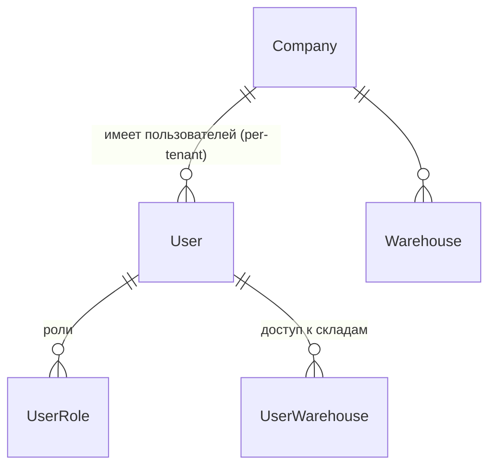

# SkladyX · Проект multi-tenant security (Этап 4A)

> Проектный этап. **Рабочий код, `prisma/schema.prisma`, миграции, prod/staging НЕ менялись.**
> Реализация — отдельным заданием 4B, малыми этапами (локально → staging → проверка → prod).
> Сверено с HEAD `df48c39` (ветка `main`, дерево чистое, `main == origin/main`).
>
> **Архитектура идентичности: per-tenant на существующем `User`.** Один и тот же телефон/email в
> разных организациях — это **разные независимые учётные записи** (`User`). Глобальный сквозной
> аккаунт не вводится. (Историю решения см. §15.)

Связанные документы: [ROSTAGRO_WORKFLOW_AUDIT.md](ROSTAGRO_WORKFLOW_AUDIT.md),
[ROSTAGRO_MIGRATION_DESIGN.md](ROSTAGRO_MIGRATION_DESIGN.md), [OPERATIONS.md](OPERATIONS.md),
[DEPLOY.md](DEPLOY.md).

---

## 1. Карта текущей реализации (подтверждено, `file:line`)

### 1.1. Идентичность и организация
- `User` (`prisma/schema.prisma:140-160`): `companyId` `:142`, `phone String? @unique` **глобально**
  `:144`, `email String? @unique` **глобально** `:145`, `passwordHash String?` `:146`,
  `role Role @default(EMPLOYEE)` — **один скаляр** `:148`, `isActive` `:149`, `allWarehouses` `:151`,
  FK `company` `:155`, `warehouseLinks UserWarehouse[]` `:157`, `@@index([companyId])` `:159`.
- **Один `User` = одна организация.** Кросс-орг членства нет.
- `Role` = `ADMIN|STOREKEEPER|EMPLOYEE` `:18-22`.
- `Company` (`:114-137`): `slug String @unique` `:117` — глобально; `settings Json` `:119`.

### 1.2. Логин / сессия / cookie
- `login(identifier, password)` (`src/lib/auth.ts:14-35`): ищет `User` по нормализованному телефону
  `:16-17` или email `:18-19` — **без контекста организации**; проверяет `isActive` `:21`,
  `passwordHash` `:22`, bcrypt `:23`; в сессию кладёт `role`+`companyId` **из записи User** `:26-32`.
- Сессия — **stateless JWT** (HS256, 7 дней), проверяется только подписью: `SessionData`
  `{userId, login, name, role, companyId}` `src/lib/jwt.ts:10-16`; `createSessionToken` `:24-30`,
  `verifySessionToken` `:32-46`. **Серверного хранилища сессий нет.**
- Cookie `skx_session` (`src/lib/session.ts:17-23`): `httpOnly`, `secure`(prod), `sameSite:"lax"`,
  `path:"/"`, `maxAge` 7д, **без `domain`** → cookie **host-only** (уже НЕ шарится между
  поддоменами — совпадает с решением «отдельная сессия на поддомен»).
- `loginAction` редиректит на `next`/`/warehouse` (`src/app/actions/auth.ts:19`); `logout` `:24`.

### 1.3. Guards / авторизация
- `requireUser` (`auth.ts:42-46`), `requireAdmin` (`:48-52`, `role!=="ADMIN"`),
  `requireStaff` (`:55-59`, `ADMIN|STOREKEEPER`); страничные `requireAdminPage` `:62-67`,
  `requireStaffPage` `:69-74`. **Авторизация основана на одном `session.role`** (из JWT, не из БД).
- Tenant-скоуп: `resolveCompanyId(session)` (`src/lib/tenant.ts:16-19`) + `scoped(session)`
  `:23-155` — все чтения фильтруются `where:{ companyId }` из сессии.
- Доступ к складам: `warehouseAccess(session)` по `User.allWarehouses`+`warehouseLinks`
  (`src/lib/warehouse-access.ts:15-22`) — **не по роли**.

### 1.4. Middleware / host
- `middleware.ts:9-32`: для `/warehouse/*` проверяет **только наличие валидной сессии** `:19-29`;
  legacy `/app→/warehouse` `:13-17`. **Host НЕ проверяется**, соответствие организации не
  проверяется. Matcher `["/warehouse/:path*","/app/:path*"]` `:35`.
- `src/lib/tenant-host.ts` — `getOrgSlugFromHost()` определён `:31`, **но нигде не вызывается**
  (подтверждено grep). Резолвинга организации по поддомену в рантайме **нет вовсе**.

### 1.5. Токены (приглашения/сброс)
- `AuthToken` (`schema.prisma:174-185`): `token String @unique` — **хранится СЫРОЙ токен** `:177`;
  `purpose "set-password"`, `expiresAt`, `usedAt`, FK `user onDelete:Cascade` `:183`.
- `createPasswordToken` (`src/lib/password-reset.ts:9-24`): `crypto.randomBytes(32).hex`, TTL
  **24ч** `:7`, гасит прежние неиспользованные `:11-14`, пишет **сырой** токен `:19`.
  `validateToken` ищет по **сырому** токену `:33`. Ссылка `${APP_URL}/auth/set/<token>` `:28`.
- `setPasswordAction` (`src/app/actions/password.ts:14`): по токену задаёт пароль, помечает
  `usedAt` `:36`, логинит (сессия с `companyId` `:44`), редирект `/warehouse` `:46`.

### 1.6. Realtime / SSE
- `api/realtime/route.ts`: `visible(ev)` `:20-31` — **изоляция по `ev.companyId !== session.companyId`**
  `:21`; ADMIN — всё `:22`; EMPLOYEE — только свои `userIds` `:23-25`; STOREKEEPER — по складам
  `:28-30`. Клиенту не отправляются `userIds/companyId`. Основано на **сессии (JWT)**.
- Шина `src/lib/realtime.ts` — **in-process** (одна реплика, каветы `:3-12`).

### 1.7. Ссылки на пользователя (важно для миграции)
- **FK-связи с `User`** только две: `UserWarehouse.user onDelete:Cascade` `:167`,
  `AuthToken.user onDelete:Cascade` `:183`.
- **Все остальные ссылки — простые String, НЕ FK**, указывают на `User.id`:
  `createdById` (Receipt `:382`, Transfer `:521`, WriteOff `:557`, PickList `:596`, Inventory `:710`,
  SupplierOrder `:337`), `actorId` (Event `:212`), `employeeId` (ItemUnit `:431`, StockBalance `:456`,
  WriteOff `:553`, Issue `:670`), `issuedById` (Issue `:674`), `pickedById` (PickList `:597`),
  `scannedById` (PickFulfillment `:641`), `uploadedById` (Attachment `:504`), `targetEmployeeId`
  (PickList `:591`), и `locKey` `E:<userId>`/`EP:<userId>` (`stock.ts:21-32`).
- **Вывод:** `User.id` — стабильный ключ, вся история завязана на него; менять его НЕ нужно и в новой
  модели (в отличие от отменённого варианта, идентичность остаётся на `User`).

### 1.8. Seed / deploy-контуры
- `prisma/seed.ts`: одна `Company` (slug `rostagro`) + один `User role:ADMIN` + единицы измерения.
  Админ ищется `findUnique({ where: { email } })` `:35`, создаётся `:37`.
- Контуры: prod `rostagro.skladyx.ru`→3003, staging `staging-rostagro.skladyx.ru`→3013, **отдельные
  БД** (см. [SERVER_INVENTORY.md](SERVER_INVENTORY.md)); nginx проксирует с `Host $host`,
  `X-Forwarded-Host $host` ([DEPLOY.md](DEPLOY.md)).

### 1.9. Карта «где `User`/`companyId` — граница безопасности»
| Точка | Файл | Сейчас |
|---|---|---|
| Аутентификация | `auth.ts:14-35` | по глобальному phone/email, без орг |
| Носитель прав | `jwt.ts:10-16` | `role`+`companyId` **в JWT** (не из БД) |
| Гейт маршрута | `middleware.ts:19-29` | только наличие сессии; host не проверяется |
| Tenant-скоуп чтения | `tenant.ts:16-155` | `companyId` из сессии |
| Складской доступ | `warehouse-access.ts:15-22` | `allWarehouses`+links |
| Realtime | `api/realtime/route.ts:20-31` | `companyId`+роль из сессии |
| Резолв орг из host | — | **отсутствует** |

---

## 2. Подтверждённые риски текущей модели

1. **Нет проверки host↔организация.** Валидная сессия работает на любом поддомене (сейчас орг одна,
   но архитектурно — дыра): `middleware.ts:19` не сверяет организацию.
2. **Права «зашиты» в JWT** (`jwt.ts:14-15`) → **нет немедленного отзыва**: блокировка/смена ролей
   не влияют на выданный 7-дневный токен до его истечения.
3. **Глобальная уникальность phone/email на `User`** (`:144-145`) связывает тенантов: телефон,
   заведённый в одной организации, нельзя переиспользовать в другой. Для per-tenant identity это
   меняется на `@@unique([companyId, …])` — но **только в S3** (см. §11), т.к. текущие
   `login`/`seed`/`users` делают `findUnique` по глобально-уникальному полю без `companyId`.
4. **Сырые токены** (`AuthToken.token` `:177`) — при утечке БД токены восстановления валидны.
5. **Один `role`** (`:148`) не покрывает мультироль.
6. **Резолвинг host не задействован** (`tenant-host.ts` мёртв) — фундамент под вход по поддомену
   отсутствует.

---

## 3. Целевая модель: per-tenant identity на `User` + `UserRole`

`User` остаётся носителем личности, пароля и членства в **одной** организации (`User.companyId`).
Новых таблиц идентичности (`Account`/`Membership`) нет. Мультироли выносятся в `UserRole`.

- **Идентичность per-tenant.** Один физический человек в двух организациях — два независимых `User`
  (свои пароль, роли, доступы). `User.id` неизменен (вся история §1.7 цела).
- **Уникальность:** целевое — `@@unique([companyId, phone])` и `@@unique([companyId, email])`
  (email нормализуется `lower(trim)`, пусто → null). Переход с глобального `@unique` — в **S3**
  (§11), синхронно с company-scoped запросами.
- **Мультироли — новая `UserRole`:** `id`, `userId`, `role Role`, `@@unique([userId, role])`,
  FK→`User` `onDelete: Cascade`, `@@index([userId])`. Organization подразумевается через
  `User.companyId`. `User.role` сохраняется в переходный период (dual-read) и удаляется в cleanup.
- **Доступ к складам** — без изменений: `User.allWarehouses` + `UserWarehouse` (`schema.prisma:151,163`).
- **Активная роль смены** — Этап 5, не здесь (в S1–S4 у `User` может быть несколько ролей без
  выбора «рабочей»).

Инварианты новых сущностей: всё tenant-scoped через `User.companyId`; уникальные ключи учитывают
организацию; движение остатков не затрагивается; forward-only миграции.

---

## 4. Роли и доступ к складам

- Роли: `UserRole` (мультироль). Guards переписываются с «`session.role === X`» (`auth.ts:48-59`)
  на «у пользователя есть роль X», **роль читается из БД на запрос** (§5), не из JWT.
- Доступ к складам: `User.allWarehouses` + `UserWarehouse` (перенос текущей логики
  `warehouse-access.ts:15-22`; уже per-user).
- Изменения ролей/складов действуют на открытые сессии **немедленно** (следствие §5: авторизация
  из БД).

---

## 5. Вход через поддомен, host→company, немедленный отзыв

- **Вход через поддомен организации.** Логин резолвит org из host (оживить `tenant-host.ts:31`,
  сейчас не вызывается), находит `Company.slug`; аутентификация — строго **внутри этой организации**
  (после S3: `findUnique({ companyId_phone })` / `{ companyId_email }`). Неизвестный поддомен →
  «Организация не найдена», вход запрещён. Нет активного `User` в организации → отказ.
- **host→company enforcement:** на каждый запрос организация из host должна совпадать с
  `session.companyId`; иначе отказ.
- **Немедленный отзыв прав:** JWT перестаёт быть носителем прав — только доказательство личности
  (`userId`+`companyId`, привязанный к орг на входе). На каждый защищённый запрос авторизация
  читается из БД: свежие `User.isActive` и роли из `UserRole`. Блокировка/смена ролей/складов
  действуют со следующего запроса без релогина. Middleware (edge) проверяет только подпись cookie;
  полная проверка членства/ролей — в `requireUser/*` (server, есть доступ к БД).
- Cookie уже host-only (`session.ts:17-23`) → сессии поддоменов изолированы; общую *.skladyx.ru
  cookie не вводим.

---

## 6. Защита последнего администратора (конкурентно безопасно)

Нельзя заблокировать/удалить/снять роль ADMIN у **последнего активного** администратора организации.
Наивная проверка `count(active ADMIN) > 1` конкурентно небезопасна (две операции над разными
админами обе пройдут). Поэтому:
- операция — в транзакции с **сериализацией доступа к множеству админов организации**:
  `SELECT … FOR UPDATE` по активным `UserRole(role=ADMIN)` этой организации, либо условный
  `updateMany` с проверкой `(count active ADMIN)>1` и `count!==1 → отказ` (паттерн ядра
  `stock.ts:88-92`);
- блокировка формулируется по **организации**, чтобы две операции над разными админами не прошли
  параллельно;
- **обязательный тест** (§12): две одновременные операции — второй ADMIN сохраняется.

---

## 7. Изоляция SSE / realtime

- Сохранить фильтр по `companyId` (`api/realtime/route.ts:21`), но источник `companyId`/ролей — из
  **свежей проверки** `User`/`UserRole` (§5), а не только JWT: при блокировке пользователя открытый
  SSE-поток должен перестать отдавать события (проверять при (пере)подключении и на heartbeat).
- Событие другой организации не доходит никогда (`ev.companyId === session.companyId`); новые типы
  событий добавлять с тем же правилом.
- Одно-процессность шины (`realtime.ts:3-12`) — вне 4A; при масштабировании фильтр не ослаблять.

---

## 8. Приглашения / восстановление / аудит (подэтап S4, на `User`/`companyId`)

Вводятся в S4 вместе с использующей их функциональностью (не в S1). Все — tenant-scoped на `User`/
`companyId`, без глобального аккаунта:
- **`Invitation`** (`companyId`, `phone`, `email?`, `tokenHash @unique` — **только хеш**, `status`
  `PENDING|ACCEPTED|REVOKED|EXPIRED`, `expiresAt` **+72ч**, `createdById`, `acceptedAt`) +
  дочерняя **`InvitationRole`**. Приглашение создаёт **`User` в конкретной организации**; одноразово,
  отзывно; **приём — одной транзакцией** (перевод `PENDING→ACCEPTED` атомарным `updateMany` +
  создание `User`/`UserRole` + аудит; при сбое — полный rollback); **проверка получателя** (принять
  можно только своё приглашение).
- **`RecoveryToken`** (`userId`, `tokenHash @unique`, `expiresAt`, `usedAt`) — одноразовая ссылка
  восстановления, только хеш, выдаётся серверной командой платформы; админ организации пароль не
  видит и не меняет.
- **`SecurityAudit`** (append-only, `companyId?`, `actorUserId?`, `action`, `targetUserId?`,
  `meta`) — **без FK**, чтобы каскад не удалял аудит; фиксирует приглашения/членство/роли/доступы/
  блокировки.
- Также в S4: перевод `AuthToken` на **хеш** и TTL под задачи (сейчас сырой токен `:177`, 24ч).

---

## 9. Платформенный суперадмин (только серверные команды)

- Представлен признаком **вне tenant-модели** (напр. флаг `isPlatformAdmin` на `User` служебной
  записи или отдельная platform-таблица без `companyId`) — **не** обычная роль `UserRole`.
- **Нет постоянного доступа** к складским данным организаций (в `/warehouse` как член не входит).
- Команды платформы (защищённые серверные скрипты, как `scripts/prod/*`): создание/блокировка
  организации; назначение первого администратора; блокировка учётной записи; создание одноразовой
  ссылки восстановления.

---

## 10. Application-scoping vs PostgreSQL RLS (RLS не внедрять молча)

| | Application-scoping (сейчас) | PostgreSQL RLS |
|---|---|---|
| Где enforce | код (`scoped()`, `where companyId`) | БД (политики на строки) |
| Плюсы | уже внедрён; работает с Prisma как есть | защита даже при забытом `where`; defense-in-depth |
| Минусы | забытый `where` = утечка; дисциплина разработчика | нужен `SET app.company_id` на соединении; сложнее пул; риск сломать запросы |
| Миграция | нулевая | значительная, рискованная |

**Рекомендация:** на 4B оставить **application-scoping** (`tenant.ts`), усилив правилом «доступ по id
— всегда `findFirst({ id, companyId })`» и тестами кросс-тенант-доступа. **RLS — кандидат в
defense-in-depth на будущее**, только отдельным обоснованным решением (не молча).

---

## 11. Порядок миграции (additive, forward-only; на `User` + `UserRole`)

Общее: forward-only; rollback кода — **revert-коммит в `main` → push → deploy** (не checkout —
deploy-guards требуют `main==origin/main`); restore БД — только при несовместимой миграции
([RESTORE.md](RESTORE.md)); допуск на prod — зелёный staging + бэкап-гейт `deploy-prod.sh` + команда
владельца ([DEPLOY.md](DEPLOY.md)). Перед каждой миграцией — свежий бэкап (гейт в `deploy-prod.sh`).

Атомарность миграций обеспечивает встроенная транзакция Prisma 6.19.3 — **проверено эмпирически** на
disposable-БД: без `BEGIN/COMMIT` `RAISE` откатывает всю миграцию целиком; явные `BEGIN/COMMIT`,
наоборот, ломают `migrate deploy`. Поэтому `BEGIN/COMMIT` в файлы миграций не добавляем; guard в SQL —
только счётчики, без ПДн.

### S1 — `UserRole` + backfill ролей (additive, БЕЗ смены уникальности)
- schema: **`+UserRole`** (`@@unique([userId, role])`, FK→User Cascade). **`User.phone/email`
  оставить глобально `@unique` как есть.**
  > ⚠️ Уникальность phone/email в S1 НЕ трогаем: `login` (`auth.ts:17,19`), `seed`
  > (`seed.ts:35`), `users` (`users.ts:68,126`) используют `findUnique` по глобально-уникальному
  > полю **без `companyId`**. Замена на `@@unique([companyId, …])` сломала бы эти `findUnique`.
  > Смена уникальности — в S3, синхронно с company-scoped запросами.
- backfill (в SQL, вместе с миграцией, детерминированно/идемпотентно): по строке `UserRole` из
  `User.role`.
- dual-write роли (теневая копия; авторизация ещё по `User.role`): **три write-path** —
  `createUserAction` (`users.ts:72`), `updateUserAction` (`users.ts:134`), создание seed-админа
  (`seed.ts:37`). (`password.ts` роли НЕ пишет — только пароль; ветка seed «добавить телефон»
  трогает phone, не роли.)
- feature flag: не нужен (теневые данные).
- проверки: counts `User` vs `UserRole`; соответствие `UserRole`↔`User.role`; вход админа РостАгро
  не изменился; миграция на пустой/seeded БД; повторный `migrate deploy` — no-op; прогон на
  временной копии prod-дампа **на сервере** (temp-контейнер без публикуемого порта и без prod/
  staging-volumes, удаляется `docker rm -fv`).
- метрики/стоп: расхождение counts; дубли `UserRole`.
- rollback: additive; откат кода не трогает данные.

### S2 — dual-read ролей
- код читает роли из `UserRole` (fallback `User.role`); guards оперируют множеством ролей.
- flag `rolesDualRead`. Проверки: права до/после совпадают. Rollback: flag off → чтение `User.role`.

### S3 — переключение авторизации + tenant-scoped уникальность
- вход по поддомену; host→company; авторизация из БД (немедленный отзыв, §5); защита последнего
  админа (§6). **Здесь же** смена уникальности: `User.phone/email` глобальный `@unique` → 
  `@@unique([companyId, phone])` / `@@unique([companyId, email])`, и перевод `findUnique`
  (`auth.ts`, `seed.ts`, `users.ts`) на company-scoped (`findUnique({ companyId_phone })` /
  `findFirst({ companyId, … })`).
  - **preflight (read-only, только счётчики, без ПДн):** нет дублей `(companyId, phone)` и
    `(companyId, lower(trim(email)))`; каноничность телефонов. Сейчас одна организация ⇒ дублей нет,
    но проверка обязательна и станет значимой со второй организацией.
- flag `tenantAuth` (сначала staging). После появления **второго tenant** откат в host-незащищённый
  режим **запрещён** — fail-closed (закрыть доступ / fix-forward / restore), а не «выключить в
  небезопасный режим».
- проверки: весь набор §12. Rollback: см. fail-closed выше.

### S4 — приглашения / восстановление / аудит
- модели `Invitation`/`InvitationRole`/`RecoveryToken`/`SecurityAudit` (§8) на `User`/`companyId`;
  `AuthToken` → хеш; управление членством админом своей организации; серверные команды платформы (§9).
- flag `invitations`. Проверки: одноразовость/истечение/отзыв; гонка приёма; транзакционность приёма;
  проверка получателя; аудит пишется.

### S5 — tenant-security тесты
- полный набор §12 в CI/verify; кросс-тенант негативные кейсы. Стоп-условие допуска: все зелёные.

### S6 — cleanup (cutover, НЕ additive)
- удалить `User.role` (роли живут в `UserRole`) после доказанной стабильности и отдельного решения;
  rollback удаления схемы — только restore БД; обязательный прогон на копии prod-данных.

---

## 12. Обязательные будущие тесты (заложить в S5)

Один человек как **независимые** учётки в двух организациях (разные `User`) · вход через оба
поддомена · отсутствие общей сессии между поддоменами · отказ при отсутствии активного `User` в
организации · немедленный отказ после блокировки/снятия роли · смена ролей/складов без релогина ·
запрет доступа по ID объекта другой компании (`findFirst({id, companyId})`) · запрет чужих server
actions/API · фильтрация realtime по компании · неизвестный поддомен → «Организация не найдена» ·
staging не обращается к prod-БД · защита последнего администратора · приглашение одноразовое/
истекает/отзывается · сохранность всех существующих ссылок на `User.id` · вход действующего
администратора РостАгро не сломан.

**Конкурентные тесты (обязательны):**
- две одновременные операции, снимающие/блокирующие ADMIN у двух разных последних админов → ровно
  одна проходит, хотя бы один активный ADMIN остаётся (§6);
- конкурентный приём одного приглашения → одно `ACCEPTED`, без дубля `User`/`UserRole` (§8);
- транзакционность приёма: при сбое не остаётся ни `User`, ни `UserRole`, ни аудита (§8).

---

## 13. Открытые технические решения (с рекомендацией)

1. **Кэш проверки прав из БД** (§5): без кэша (проще, +1 запрос) vs короткий TTL с инвалидацией.
   **Рек.:** старт без кэша; кэш — при доказанной нагрузке.
2. **Маппинг `staging-<slug>`→`<slug>`** (§5, [SERVER_INVENTORY]): **конфигурация окружения** (env
   `HOST_ORG_PREFIX`, активен только на staging; в prod не активен → `staging-…` = «не найдена»).
3. **Роли в JWT vs только `userId`+`companyId`** (§5): **Рек.:** JWT несёт только личность+орг,
   права из БД.
4. **`isPlatformAdmin`: флаг на служебном `User` vs platform-таблица** (§9): **Рек.:** отдельная
   platform-сущность без `companyId`, чтобы не смешивать со складскими `User`/`UserRole`.
5. **localhost dev-режим:** `DEFAULT_ORG_SLUG` только при `NODE_ENV!=="production"`.
6. **RLS** (§10): отложить; отдельное решение.

---

## 14. Критерии готовности к реализации 4B/S1

- Владелец утвердил целевую модель (§3), порядок миграции (§11) и решения §13.
- Подтверждено: S1 **не меняет** глобальную уникальность phone/email (login/seed/users на
  `findUnique` без `companyId` работают без изменений); смена — в S3.
- Карта dual-write ролей S1 = `createUserAction` + `updateUserAction` + seed-админ (не `password.ts`).
- Набор тестов §12 принят как обязательный для допуска на prod.
- Определён объём S1 (только `UserRole` + backfill + dual-write ролей).

---

## 15. Историческая заметка (решение отменено)

Ранее в проекте 4A рассматривался **глобальный `Account` + `Membership`** (один сквозной аккаунт в
нескольких организациях, phone/email глобально уникальны). **Решение отменено владельцем 2026-07-30**
в пользу per-tenant identity на существующем `User` (см. §3). Соответствующая экспериментальная
реализация S1 (локальная, не коммиченная) откачена; действующие разделы документа описывают только
актуальную модель.
