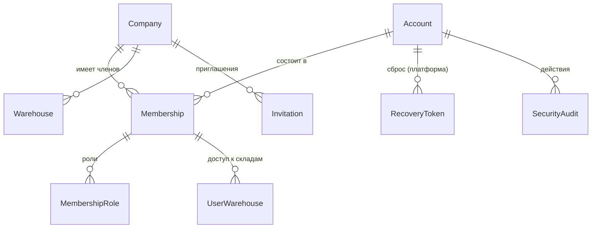
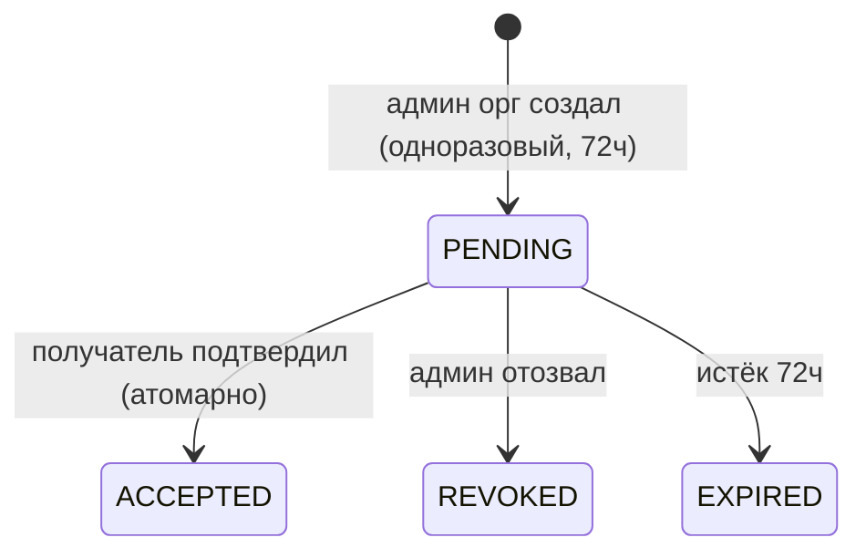

# SkladyX · Проект multi-tenant security (Этап 4A)

> Проектный этап. **Рабочий код, `prisma/schema.prisma`, миграции, prod/staging НЕ менялись.**
> Реализация — отдельным заданием 4B, малыми этапами (локально → staging → проверка → prod).
> Сверено с HEAD `0b26601` (ветка `main`, дерево чистое, `main == origin/main`).

Связанные документы: [ROSTAGRO_WORKFLOW_AUDIT.md](ROSTAGRO_WORKFLOW_AUDIT.md),
[ROSTAGRO_MIGRATION_DESIGN.md](ROSTAGRO_MIGRATION_DESIGN.md), [OPERATIONS.md](OPERATIONS.md),
[DEPLOY.md](DEPLOY.md).

---

## 1. Карта текущей реализации (подтверждено, `file:line`)

### 1.1. Идентичность и организация
- `User` (`prisma/schema.prisma:140-160`): `companyId` `:142`, `phone String? @unique` **глобально**
  `:144`, `email String? @unique` **глобально** `:145`, `passwordHash String?` `:146`,
  `role Role @default(EMPLOYEE)` — **один скаляр** `:148`, `isActive` `:149`, `allWarehouses` `:151`,
  FK `company` `:155`, `warehouseLinks UserWarehouse[]` `:157`, `@@index([companyId])` `:159`.
- **Один `User` = одна организация.** Кросс-орг членства нет.
- `Role` = `ADMIN|STOREKEEPER|EMPLOYEE` `:18-22`.
- `Company` (`:114-137`): `slug String @unique` `:117` — глобально; `settings Json` `:119`.

### 1.2. Логин / сессия / cookie
- `login(identifier, password)` (`src/lib/auth.ts:14-35`): ищет `User` по нормализованному телефону
  `:16-17` или email `:18-19` — **без контекста организации**; проверяет `isActive` `:21`,
  `passwordHash` `:22`, bcrypt `:23`; в сессию кладёт `role`+`companyId` **из записи User** `:26-32`.
- Сессия — **stateless JWT** (HS256, 7 дней), проверяется только подписью: `SessionData`
  `{userId, login, name, role, companyId}` `src/lib/jwt.ts:10-16`; `createSessionToken` `:24-30`,
  `verifySessionToken` `:32-46`. **Серверного хранилища сессий нет.**
- Cookie `skx_session` (`src/lib/session.ts:17-23`): `httpOnly`, `secure`(prod), `sameSite:"lax"`,
  `path:"/"`, `maxAge` 7д, **без `domain`** → cookie **host-only** (уже НЕ шарится между
  поддоменами — совпадает с решением «отдельная сессия на поддомен»).
- `loginAction` редиректит на `next`/`/warehouse` (`src/app/actions/auth.ts:19`); `logout` `:24`.

### 1.3. Guards / авторизация
- `requireUser` (`auth.ts:42-46`), `requireAdmin` (`:48-52`, `role!=="ADMIN"`),
  `requireStaff` (`:55-59`, `ADMIN|STOREKEEPER`); страничные `requireAdminPage` `:62-67`,
  `requireStaffPage` `:69-74`. **Авторизация основана на одном `session.role`** (из JWT, не из БД).
- Tenant-скоуп: `resolveCompanyId(session)` (`src/lib/tenant.ts:16-19`) + `scoped(session)`
  `:23-155` — все чтения фильтруются `where:{ companyId }` из сессии.
- Доступ к складам: `warehouseAccess(session)` по `User.allWarehouses`+`warehouseLinks`
  (`src/lib/warehouse-access.ts:15-22`) — **не по роли**.

### 1.4. Middleware / host
- `middleware.ts:9-32`: для `/warehouse/*` проверяет **только наличие валидной сессии** `:19-29`;
  legacy `/app→/warehouse` `:13-17`. **Host НЕ проверяется**, соответствие организации не
  проверяется. Matcher `["/warehouse/:path*","/app/:path*"]` `:35`.
- `src/lib/tenant-host.ts` — `getOrgSlugFromHost()` определён `:31`, **но нигде не вызывается**
  (подтверждено grep). Резолвинга организации по поддомену в рантайме **нет вовсе**.

### 1.5. Токены (приглашения/сброс)
- `AuthToken` (`schema.prisma:174-185`): `token String @unique` — **хранится СЫРОЙ токен** `:177`;
  `purpose "set-password"`, `expiresAt`, `usedAt`, FK `user onDelete:Cascade` `:183`.
- `createPasswordToken` (`src/lib/password-reset.ts:9-24`): `crypto.randomBytes(32).hex`, TTL
  **24ч** `:7`, гасит прежние неиспользованные `:11-14`, пишет **сырой** токен `:19`.
  `validateToken` ищет по **сырому** токену `:33`. Ссылка `${APP_URL}/auth/set/<token>` `:28`.
- `setPasswordAction` (`src/app/actions/password.ts:14`): по токену задаёт пароль, помечает
  `usedAt` `:36`, логинит (сессия с `companyId` `:44`), редирект `/warehouse` `:46`.

### 1.6. Realtime / SSE
- `api/realtime/route.ts`: `visible(ev)` `:20-31` — **изоляция по `ev.companyId !== session.companyId`**
  `:21`; ADMIN — всё `:22`; EMPLOYEE — только свои `userIds` `:23-25`; STOREKEEPER — по складам
  `:28-30`. Клиенту не отправляются `userIds/companyId`. Основано на **сессии (JWT)**.
- Шина `src/lib/realtime.ts` — **in-process** (одна реплика, каветы `:3-12`).

### 1.7. Ссылки на пользователя (важно для миграции)
- **FK-связи с `User`** только две: `UserWarehouse.user onDelete:Cascade` `:167`,
  `AuthToken.user onDelete:Cascade` `:183`.
- **Все остальные ссылки — простые String, НЕ FK**, указывают на `User.id`:
  `createdById` (Receipt `:382`, Transfer `:521`, WriteOff `:557`, PickList `:596`, Inventory `:710`,
  SupplierOrder `:337`), `actorId` (Event `:212`), `employeeId` (ItemUnit `:431`, StockBalance `:456`,
  WriteOff `:553`, Issue `:670`), `issuedById` (Issue `:674`), `pickedById` (PickList `:597`),
  `scannedById` (PickFulfillment `:641`), `uploadedById` (Attachment `:504`), `targetEmployeeId`
  (PickList `:591`), и `locKey` `E:<userId>`/`EP:<userId>` (`stock.ts:21-32`).
- **Вывод:** пока идентификатор `User.id` сохраняется, вся история остаётся связной. Миграцию нужно
  строить так, чтобы `User.id` оставался стабильным ключом «члена организации».

### 1.8. Seed / deploy-контуры
- `prisma/seed.ts`: одна `Company` (slug `rostagro`) + один `User role:ADMIN` + единицы измерения.
- Контуры: prod `rostagro.skladyx.ru`→3003, staging `staging-rostagro.skladyx.ru`→3013, **отдельные
  БД** (см. [SERVER_INVENTORY.md](SERVER_INVENTORY.md)); nginx проксирует с `Host $host`,
  `X-Forwarded-Host $host` ([DEPLOY.md](DEPLOY.md)).

### 1.9. Карта «где `User`/`companyId` — граница безопасности»
| Точка | Файл | Сейчас |
|---|---|---|
| Аутентификация | `auth.ts:14-35` | по глобальному phone/email, без орг |
| Носитель прав | `jwt.ts:10-16` | `role`+`companyId` **в JWT** (не из БД) |
| Гейт маршрута | `middleware.ts:19-29` | только наличие сессии; host не проверяется |
| Tenant-скоуп чтения | `tenant.ts:16-155` | `companyId` из сессии |
| Складской доступ | `warehouse-access.ts:15-22` | `allWarehouses`+links |
| Realtime | `api/realtime/route.ts:20-31` | `companyId`+роль из сессии |
| Резолв орг из host | — | **отсутствует** |

---

## 2. Подтверждённые риски текущей модели

1. **Нет проверки host↔организация.** Валидная сессия работает на любом поддомене (сейчас орг одна,
   но архитектурно — дыра): `middleware.ts:19` не сверяет организацию.
2. **Права «зашиты» в JWT** (`jwt.ts:14-15`) → **нет немедленного отзыва**: блокировка членства/
   смена ролей не влияют на выданный 7-дневный токен до его истечения.
3. **Глобальная уникальность phone/email на `User`** (`:144-145`) связывает тенантов и не
   поддерживает «один аккаунт в нескольких организациях».
4. **Сырые токены** (`AuthToken.token` `:177`) — при утечке БД токены восстановления валидны.
5. **Один `role`** (`:148`) не покрывает мультироль.
6. **Резолвинг host не задействован** (`tenant-host.ts` мёртв) — фундамент под вход по поддомену
   отсутствует.

---

## 3. Целевая модель: глобальный аккаунт + членство

Зафиксировано владельцем: один глобальный аккаунт; аккаунт может состоять в нескольких организациях;
per-org хранятся членство, активность/блокировка, роли, доступ к складам, будущая активная смена.



**`Account`** — глобальная личность и учётные данные (единственный носитель пароля):
`id`, `phone String @unique` (обязателен), `email String? @unique` (опц., уникален когда задан),
`passwordHash String?`, `name`, `isBlocked Boolean @default(false)` (глобальная блокировка — только
платформенный суперадмин), `isPlatformAdmin Boolean @default(false)` (platform-level, **без**
`companyId`), `createdAt/updatedAt`.

**`Membership`** — членство аккаунта в организации (то, чем сейчас является `User`; см. §4 про
сохранение `User.id`): `id`, `accountId`, `companyId`, `status` (`ACTIVE|BLOCKED`),
`allWarehouses Boolean`, timestamps; `@@unique([companyId, accountId])`; `@@index([companyId])`.
Историческая связь: **`Membership.id` = сегодняшний `User.id`** (стабильный ключ для всех `*ById`).

**`MembershipRole`** — мультироль: `id`, `membershipId`, `role Role`; `@@unique([membershipId, role]`.

**Доступ к складам** — существующий `UserWarehouse` (membership↔warehouse) переиспользуется.

**Будущая активная смена** — вне 4A (Этап 5); в модели оставляется точка расширения
(`Membership` ↔ future `WorkShift`), но не реализуется.

**Платформенный суперадмин** — `Account.isPlatformAdmin` (не company-scoped роль; в `Membership`/
`MembershipRole` не входит). Постоянного доступа к складским данным нет; работает только через
защищённые серверные команды (§9).

Инварианты: `phone`/`email` глобально уникальны на `Account`; вся tenant-изоляция — по `companyId`
через `Membership` и `scoped()`; новые таблицы — с `companyId`, где это tenant-данные, и уникальные
ключи с `companyId`.

---

## 4. Миграция существующего `User` без потери связей и пароля

**Ключевой принцип:** `User.id` не меняется — становится `Membership.id`. Историю (§1.7) не трогаем.

Дополнительно к таблице `User` (реинтерпретируется как `Membership`):
1. Создать `Account`; для каждого существующего `User` — один `Account`, копируя `phone`, `email`,
   `passwordHash`, `name`. `Account.email` получает глобальный `@unique`.
   **Важно — `User.phone` сейчас nullable** (`schema.prisma:144` `phone String?`): часть аккаунтов
   может быть без телефона (вход по email). Целевая модель требует `Account.phone` обязательным и
   уникальным, но включать NOT NULL сразу нельзя. Порядок:
   - **preflight-аудит на копии данных**: сколько `User` без `phone`; дубликаты `phone`/`email`
     после нормализации; коллизии (один и тот же нормализованный телефон у разных User);
   - **`Account.phone` создаётся nullable** (переходно) + глобальный `@unique`; backfill копирует
     существующие телефоны;
   - **нормализация** телефона (через существующий `normalizePhone` `src/lib/phone.ts`) и email
     (`lower/trim`, как в `auth.ts:19`) перед записью — чтобы уникальность считалась по канону;
   - аккаунтам без телефона телефон **дозаполняется** (бизнес-процессом/командой платформы) —
     до этого они остаются с `phone=null`;
   - **NOT NULL на `Account.phone` добавляется ОТДЕЛЬНОЙ поздней миграцией**, только когда preflight
     подтвердил, что незаполненных телефонов не осталось (иначе миграция упадёт). Это отдельный шаг,
     не в одном релизе с созданием `Account`.
2. Добавить `User.accountId` (nullable на этапе backfill) → проставить связь 1:1.
3. `MembershipRole` заполнить из `User.role` (один → одна строка).
4. `User.status` вывести из `User.isActive` (`true→ACTIVE`, `false→BLOCKED`).
5. `phone/email/passwordHash/role` на `User` **пока не удалять** (dual-read) — удаление только в
   финальном cleanup после доказанной стабильности (§8, отдельный класс — не в одном релизе).
6. `AuthToken` (сейчас FK на `User`, сырой токен) → перевести на `Account` (пароль глобальный) и на
   **хеш** (§6). Старые записи можно погасить (usedAt) — они одноразовые.

**Backfill РостАгро:** одна `Company(slug=rostagro)` уже есть; её единственный `User(ADMIN)`
получает `Account`(из его phone/email/passwordHash), `Membership(status=ACTIVE, accountId)`,
`MembershipRole(ADMIN)`. **Действующий администратор РостАгро сохраняет доступ**, т.к. его `User.id`,
`companyId`, `passwordHash` и складские связи не меняются, а вход по его телефону продолжает
работать (теперь через `Account`).

Почему связи не рвутся: `*ById`/`employeeId`/`locKey` — String на `User.id` (§1.7), а он стабилен;
две реальные FK (`UserWarehouse`, `AuthToken`) мигрируются явно.

---

## 5. Мультироль и доступ к складам

- Роли: `MembershipRole` (`@@unique([membershipId, role])`). Guards переписываются с
  «`session.role === X`» (`auth.ts:48-59`) на «у активного членства есть роль X», роль читается
  **из БД на каждый запрос** (§7), не из JWT.
- Доступ к складам: `UserWarehouse` + `Membership.allWarehouses` (перенос текущей логики
  `warehouse-access.ts:15-22` на membership).
- Изменения ролей/складов применяются к открытым сессиям **немедленно** — следствие §7
  (авторизация из БД, JWT прав не несёт).

---

## 6. Приглашения (хранить только хеш токена)

**`Invitation`**: `id`, `companyId`, `accountId String?` (для существующего аккаунта; null — новый
пользователь), `phone`, `email String?`, `roles Role[]` (или через дочернюю таблицу), `tokenHash
String @unique` (**хранится только SHA-256 от токена**; сырой токен только в ссылке, в БД никогда),
`status` (`PENDING|ACCEPTED|REVOKED|EXPIRED`), `expiresAt` (**+72ч**), `createdById`, `acceptedAt`,
`createdAt`; `@@index([companyId, status])`.



- **Существующий пользователь** присоединяется к организации через приглашение и **сам подтверждает**
  (создаётся `Membership`+`MembershipRole`).
- **Новый пользователь** открывает приглашение → задаёт пароль → активирует `Account` (+`Membership`).
- **Принятие — ОДНА транзакция** (всё или ничего): (1) атомарный перевод `updateMany(where
  status=PENDING → ACCEPTED)` с `count!==1 → откат` (паттерн ядра `stock.ts:88-92`); (2) создание/
  привязка `Account` (для нового пользователя — с установкой пароля); (3) создание `Membership`
  (`@@unique([companyId, accountId])` защищает от дубля); (4) создание `MembershipRole` из ролей
  приглашения; (5) запись `SecurityAudit` (`invite.accepted`). Любой сбой → полный rollback, ни
  аккаунт, ни членство, ни аудит не остаются в половинчатом состоянии.
- **Проверка получателя:** приглашение принимает именно тот, кому оно адресовано —
  для приглашения существующего аккаунта (`accountId` задан) требуется, чтобы **текущая сессия/
  вход соответствовали `Invitation.accountId`** (или подтверждаемый телефон/email совпал с целевым
  `phone`/`email` приглашения); нельзя принять чужое приглашение и присоединить к организации другой
  аккаунт. Несовпадение получателя → отказ (в аудит — попытка).
- **Одноразовость при гонке:** шаг (1) гарантирует, что из двух одновременных принятий проходит одно.
- **Отзыв/истечение:** `REVOKED` вручную; `EXPIRED` по `expiresAt` (проверка при валидации + фоновая
  пометка). Хранение только хеша: валидация = `find by sha256(raw)`.
- Админ организации управляет приглашениями **только своей** организации.

---

## 7. Немедленный отзыв прав открытой сессии

**Проблема:** JWT stateless (`jwt.ts`), несёт `role`+`companyId` как истину → отзыв невозможен до
истечения.

**Решение (рекомендуется):** JWT перестаёт быть носителем прав — становится только **доказательством
личности** (`accountId`, привязка к орг из поддомена на момент логина). На **каждый** защищённый
запрос авторизация читается из БД:
1. резолв организации из host (§8) → `companyId`;
2. загрузка `Membership(accountId, companyId)` **свежая**: нет/`BLOCKED`/`Account.isBlocked` → 401;
3. роли/склады — из `MembershipRole`/`UserWarehouse` в этом же чтении.

Так блокировка членства, смена ролей/складов и глобальная блокировка действуют **немедленно** (со
следующего запроса), без повторного входа. Стоимость — 1 индексированное чтение членства на запрос
(можно кэшировать на короткий TTL с инвалидацией по `Membership.updatedAt`/эпохе — открытое решение
§13). Middleware (edge) проверяет только наличие/подпись cookie; полноценная проверка членства — в
`requireUser/*` (server, есть доступ к БД).

Альтернатива (эпоха): `Membership.securityVersion`, JWT несёт версию, сверка — тоже требует чтения;
выбор кэш-стратегии — §13.

---

## 8. host tenant == membership company; prod/staging/localhost; защита от подмены Host

**Резолв организации из поддомена** (оживить `tenant-host.ts`):
- из `Host`/`X-Forwarded-Host` извлечь первый лейбл; найти `Company.slug`;
- **неизвестный поддомен → «Организация не найдена», вход запрещён** (не фоллбэк на rostagro — текущий
  `getOrgSlugFromHost` даёт fallback `:32`, это надо изменить для строгого режима);
- при логине и на каждом запросе: `session.accountId` должен иметь **активное членство** в
  резолвнутой организации; иначе — отказ («нет членства»).

**Контуры:**
- prod `rostagro.skladyx.ru` → org `rostagro`.
- **staging `staging-rostagro.skladyx.ru` → та же org `rostagro`, но отдельная staging-БД.**
  Срез префикса `staging-` — **не безусловное правило в коде, а КОНФИГУРАЦИЯ окружения**: например
  env `HOST_ORG_PREFIX="staging-"` (или конфигурируемый маппинг host→slug), применяемый **только на
  staging-контуре**. В prod префикс-правило **не активно** (env не задан) → `staging-…` там просто
  «неизвестный поддомен» → «Организация не найдена». Так поведение задаётся контуром, а не зашито
  глобально. staging никогда не обращается к prod-БД — гарантируется отдельным `.env`/контуром.
- **localhost / прямой IP:** нет поддомена → орг не резолвится. Для dev — явный `DEFAULT_ORG_SLUG`
  (dev-only) ИЛИ заголовок/переменная; в prod/staging fallback запрещён.

**Подмена Host за nginx:** nginx задаёт `Host $host`/`X-Forwarded-Host $host` (доверенный источник,
[DEPLOY.md](DEPLOY.md)). Доверять только заголовку, который проставляет наш reverse-proxy. Но host —
лишь **выбор кандидата организации**; фактический доступ всегда дополнительно ограничен: (а) активным
членством `accountId` в этой организации; (б) `companyId`-скоупом всех запросов. Даже при подделке
host злоумышленник без членства получает отказ, а данные другой орг недоступны из-за scoped-queries.
**Защита от доступа по чужому ID:** любые `findById` заменяются/остаются `findFirst({ id, companyId })`
(как в `tenant.ts`), а мутации берут `companyId` из membership, не из клиента.

---

## 9. Платформенный суперадмин (только серверные команды)

- Представлен `Account.isPlatformAdmin` (platform-level, без `companyId`, вне `MembershipRole`).
- **Нет постоянного доступа** к складским данным организаций (UI/actions его не пускают в
  `/warehouse` как обычного члена).
- Команды 4A ограничены (защищённые серверные скрипты, как `scripts/prod/*`):
  1. создание/блокировка организации;
  2. назначение первого администратора;
  3. блокировка глобального аккаунта;
  4. создание одноразовой ссылки восстановления.
- Восстановление пароля (пока нет SMS/email): суперадмин серверной командой создаёт `RecoveryToken`.

**`RecoveryToken`** (или расширенный `AuthToken` на хеше): `id`, `accountId`, `tokenHash @unique`,
`expiresAt`, `usedAt`, `createdAt`. Одноразовый; хранится **только хеш**; выдаётся только командой
платформы. Админ организации **не видит и не меняет** глобальный пароль.

---

## 10. Неизменяемый security-аудит

**`SecurityAudit`** (append-only): `id`, `companyId String?` (null для платформенных действий),
`actorAccountId`, `action` (enum/строка: `invite.created/accepted/revoked`, `membership.created/
blocked/unblocked`, `role.granted/revoked`, `warehouse.granted/revoked`, `account.blocked`,
`recovery.created`, `org.created/blocked`), `targetAccountId String?`, `targetMembershipId String?`,
`meta Json?`, `createdAt`; `@@index([companyId, createdAt])`.
- Только `create`; без `update`/`delete` в коде (инвариант, проверяется ревью/тестом). Отличается
  от текущего `Event` (`schema.prisma:204`, оперативная лента) — это отдельный журнал безопасности.

---

## 11. Инварианты доступа и защита «последнего администратора»

- Блокировка членства ≠ блокировка глобального аккаунта. Глобальная блокировка — только суперадмин.
- Админ организации управляет членством/ролями/складами **только своей** организации; может назначать
  других администраторов.
- **Нельзя** заблокировать/удалить/снять роль ADMIN у **последнего активного** администратора
  организации. Проверка `count(active ADMIN memberships) > 1` **конкурентно небезопасна** при наивной
  реализации: две одновременные операции над двумя разными админами обе увидят «админов ещё 2» и
  обе пройдут → организация останется без админа (гонка «check-then-act»). Поэтому:
  - операция выполняется в транзакции с **сериализацией доступа к множеству админов организации**:
    либо `SELECT … FOR UPDATE` по строкам активных `MembershipRole(role=ADMIN)` этой организации
    (пессимистичная блокировка), либо транзакция уровня `Serializable` с повтором при конфликте
    сериализации;
  - альтернатива на существующем атомарном паттерне ядра (`stock.ts:88-92`): условный
    `updateMany(where <снятие ADMIN> AND (select count active ADMIN)>1)`; `count!==1` → отказ;
  - формулировать блокировку по **организации** (а не по конкретной строке), чтобы две операции над
    разными админами не могли выполниться параллельно.
  - **Обязательный тест** — §15 (две одновременные операции, снимающие ADMIN у двух разных
    последних админов: ровно одна проходит, второй ADMIN сохраняется).
- Все действия §6/§9/§11 → запись в `SecurityAudit` (§10).

---

## 12. Изоляция SSE / realtime

- Сохранить фильтр по `companyId` (`api/realtime/route.ts:21`), но источник `companyId`/ролей —
  **свежая проверка членства** (§7), а не только JWT: при блокировке членства открытый SSE-поток
  должен перестать отдавать события (проверять членство при (пере)подключении и периодически на
  heartbeat).
- Событие другой организации не должно доходить никогда (уже так по `:21`); новые типы событий
  (роли/членство) добавить в фильтр с тем же правилом `ev.companyId === membership.companyId`.
- Одно-процессность шины (`realtime.ts:3-12`) — вне 4A, но при масштабировании фильтр не должен
  ослабевать.

---

## 13. Application-scoping vs PostgreSQL RLS (RLS не внедрять молча)

| | Application-scoping (сейчас) | PostgreSQL RLS |
|---|---|---|
| Где enforce | код (`scoped()`, `where companyId`) | БД (политики на строки) |
| Плюсы | уже внедрён; гибко; работает с Prisma как есть | защита даже при забытом `where`; defense-in-depth |
| Минусы | забытый `where` = утечка; дисциплина на разработчике | Prisma+RLS требует прокидывать `SET app.company_id` на соединении; сложнее пул соединений; риск сломать существующие запросы |
| Миграция | нулевая | значительная, рискованная |

**Рекомендация:** на 4A оставить **application-scoping** (совпадает с текущим `tenant.ts`), усилив
его правилом «все доступы по id — через `findFirst({id, companyId})`» и тестами кросс-тенант-доступа.
**RLS — кандидат в defense-in-depth на будущее**, внедрять только отдельным обоснованным решением
(не молча), т.к. затрагивает работу с соединениями и весь набор запросов.

---

## 14. Порядок миграции (additive, без разрушения за один релиз)

Общее: forward-only; rollback кода — **revert-коммит в `main` → push → deploy** (не checkout;
deploy-guards требуют `main==origin/main`); restore БД — только при несовместимой миграции
([RESTORE.md](RESTORE.md)); допуск на prod — зелёный staging + бэкап-гейт `deploy-prod.sh` + команда
владельца ([DEPLOY.md](DEPLOY.md)). **Перед каждым этапом со схемой — свежий бэкап (гейт уже в
`deploy-prod.sh`).**

### Этап S1 — новые таблицы + backfill
- **preflight (до миграции, на копии данных):** число `User` без `phone` (nullable `:144`);
  дубликаты нормализованных `phone`/`email`; коллизии нормализации. Стоп при дубликатах/коллизиях.
- schema: +`Account` (**`phone` nullable** переходно, `@unique`; `email? @unique`),
  +`MembershipRole`, +`Invitation`, +`RecoveryToken`, +`SecurityAudit`;
  +`User.accountId?`, +`User.status?` (nullable). Не удалять старые поля. **NOT NULL на
  `Account.phone` НЕ в этом этапе** — отдельной поздней миграцией после дозаполнения (§4).
- backfill: Account на каждый User с **нормализацией** phone (`normalizePhone`) и email (lower/trim);
  accountId; MembershipRole из role; status из isActive; РостАгро.
- feature flag: нет поведенческого переключения (только данные).
- проверки: 1:1 User↔Account; уникальность нормализованных phone/email на Account; все `*ById`
  резолвятся; аккаунты без телефона видимы в отчёте preflight.
- staging-сценарий: прогон backfill на staging-БД; сверка counts до/после.
- метрики/стоп: расхождение числа User/Account; дубликаты phone/email после нормализации → стоп.
- rollback: таблицы аддитивные; откат кода не трогает данные; при необходимости — оставить как есть.
- restore-влияние: бэкап перед миграцией; несовместимость → restore.
- **отдельный поздний под-этап S1b:** `ALTER Account.phone SET NOT NULL` — только после того как
  preflight показал 0 незаполненных телефонов; иначе миграция падает (forward-only → restore).

### Этап S2 — двойное чтение / совместимость
- код читает личность из `Account`, роли из `MembershipRole`, склады из `UserWarehouse`, с
  **fallback** на старые поля `User`. Логин ещё по-старому.
- flag: `identityDualRead` (по умолчанию on после S1).
- проверки: вход действующего админа РостАгро; чтение ролей/складов идентично старому.
- staging: полный regress текущих сценариев (verify-скрипты).
- стоп: любое расхождение прав до/после.
- rollback: flag off → чтение только из старых полей.

### Этап S3 — переключение авторизации (host + membership + отзыв)
- логин резолвит орг из поддомена; аутентификация против `Account`; сессия несёт `accountId`;
  авторизация — **из БД по членству на каждый запрос** (§7); host==membership; неизвестный поддомен
  → «Организация не найдена»; отсутствие членства → отказ.
- flag: `tenantAuth` (поэтапно: сначала staging).
- проверки: все обязательные тесты §15.
- staging: вход через поддомен; блокировка членства → немедленный отказ; смена ролей без релогина.
- метрики: отказы по host-mismatch, латентность членского чтения. стоп: обход изоляции.
- rollback:
  - **пока в системе одна организация** — допустим `flag off → прежний auth` (JWT-права, без host):
    кросс-тенант-риска нет, т.к. tenant один;
  - **после появления второго tenant откат на host-незащищённую авторизацию ЗАПРЕЩЁН** — иначе
    сессия одной организации получит доступ к данным другой (прежний `middleware.ts:19` host не
    проверяет). При проблеме откат обязан оставаться **fail-closed**: не возвращать небезопасный
    режим, а отказывать во входе/доступе (показывать деградацию/сервисное сообщение) до исправления
    вперёд (fix-forward) или restore БД. Feature-flag `tenantAuth` в присутствии ≥2 организаций
    трактуется как «включён либо доступ закрыт», без варианта «выключить в небезопасный режим».

### Этап S4 — приглашения и управление членством
- UI/actions: создание/отзыв приглашений (хеш, 72ч), самоподтверждение, управление ролями/складами,
  защита последнего админа; серверные команды платформы (§9).
- flag: `invitations`.
- проверки: одноразовость/истечение/отзыв; **гонка принятия (одно проходит)**; **транзакционность
  принятия** (аккаунт+членство+роли+аудит — всё или ничего); **проверка получателя** (нельзя принять
  чужое приглашение); **конкурентная защита последнего админа** (две одновременные операции — второй
  ADMIN сохраняется); аудит пишется на каждое действие.
- staging: пригласить нового и существующего; отозвать; истечь; две параллельные операции над
  последними админами.
- стоп: двойное принятие; половинчатое членство при сбое; потеря последнего админа.
- rollback: flag off → управление членством прежним путём (seed/ручное).

### Этап S5 — tenant-security тесты
- полный набор §15 в CI/verify; кросс-тенант негативные кейсы.
- стоп-условие релиза 4B: все тесты §15 зелёные на staging.

### Этап S6 — cleanup старых полей (после доказанной стабильности; НЕ additive)
- удалить `User.phone/email/passwordHash/role` (перенесены в Account/MembershipRole); переименовать
  `User`→`Membership` (опционально, с осторожностью к `*ById`-семантике).
- только после периода наблюдения и отдельного решения; rollback удаления схемы — **только restore
  БД**; обязательный прогон на копии prod-данных.

---

## 15. Обязательные будущие тесты (заложить в S5)

Один аккаунт в двух организациях · вход через оба поддомена · отсутствие общей сессии между
поддоменами · отказ при отсутствии членства · немедленный отказ после блокировки · смена ролей/
складов без релогина · запрет доступа по ID объекта другой компании · запрет чужих server actions/
API · фильтрация realtime по компании · неизвестный поддомен → «Организация не найдена» · staging не
обращается к prod-БД · защита последнего членства администратора · приглашение одноразовое/истекает/
отзывается · сохранность всех существующих ссылок на пользователя · отсутствие потери доступа
действующего администратора РостАгро.

**Конкурентные тесты (обязательны):**
- **две одновременные операции**, снимающие/блокирующие ADMIN у двух разных последних админов одной
  организации → ровно одна проходит, хотя бы один активный ADMIN остаётся (§11);
- **конкурентное принятие одного приглашения** двумя запросами → одно `ACCEPTED`, второе отклонено,
  дублирующего членства нет (§6);
- **транзакционность принятия**: при инъецированном сбое на середине принятия не остаётся ни
  аккаунта, ни членства, ни ролей, ни аудита (полный rollback) (§6);
- проверка получателя: попытка принять чужое приглашение отклоняется и попадает в аудит (§6).

---

## 16. Оставшиеся технические решения (с рекомендацией)

1. **Кэш членского чтения** (§7): без кэша (проще, +1 запрос) vs короткий TTL с инвалидацией по
   эпохе. **Рек.:** старт без кэша; кэш — при доказанной нагрузке.
2. **Маппинг `staging-<slug>`→`<slug>`** (§8): **через конфигурацию окружения** (env
   `HOST_ORG_PREFIX`, активен только на staging) vs список доменов у `Company`. **Рек.:** env-конфиг
   префикса (в prod не активен → `staging-…` = «Организация не найдена»); у `Company` остаётся один
   slug. Не зашивать срез префикса безусловно в код.
3. **Роли приглашения — массив на `Invitation` vs дочерняя таблица.** **Рек.:** дочерняя
   `InvitationRole` для единообразия с `MembershipRole`.
4. **`RecoveryToken` отдельно vs расширить `AuthToken`.** **Рек.:** переиспользовать `AuthToken`,
   переведя на хеш и на `accountId`, добавив `purpose` (`invite`/`set-password`/`recovery`).
5. **Переименование `User`→`Membership`** (§14 S6): делать vs оставить имя `User`. **Рек.:** оставить
   имя `User` до отдельного решения — переименование рискованно из-за широкой `*ById`-семантики.
6. **localhost dev-режим** (§8): `DEFAULT_ORG_SLUG` только dev vs dev-заголовок. **Рек.:**
   `DEFAULT_ORG_SLUG` только при `NODE_ENV!=="production"`.
7. **RLS** (§13): отложить; отдельное решение.

---

## 17. Критерии готовности к реализации Этапа 4B

- Владелец утвердил целевую модель (§3), порядок миграции (§14) и решения §16.
- Подтверждено: backfill РостАгро сохраняет доступ действующего админа и все `*ById`-ссылки (§4).
- Согласован механизм немедленного отзыва (§7) и его стоимость.
- Согласовано поведение host/staging/localhost и строгий режим «неизвестный поддомен» (§8).
- Определён объём S1 (только новые таблицы + backfill, без переключения авторизации).
- Набор тестов §15 принят как обязательный для допуска на prod.

---

## 18. Предлагаемые изменения контекстных документов (НЕ применены)

`ROADMAP.md` (правку Этапа 4 — после подтверждения):
```
## Этап 4. Multi-tenant security
...
- [ ] 4A. Проект — docs/MULTITENANT_SECURITY_DESIGN.md (глобальный аккаунт + членство, host-auth,
      немедленный отзыв, приглашения, аудит). ✅ спроектировано
- [ ] 4B. Реализация малыми этапами S1–S6 (локально → staging → prod)
```
`PROJECT_CONTEXT.md` (в раздел про tenant/security — после подтверждения):
```
Идентичность: глобальный Account (phone/email глобально уникальны) + Membership per-organization
(роли, доступ к складам, блокировка). Вход через поддомен организации; сессия отдельная на поддомен;
авторизация проверяется по членству из БД (немедленный отзыв). Детали — docs/MULTITENANT_SECURITY_DESIGN.md.
```
Точные diff дам в финальном отчёте; без отдельного подтверждения не менять.
