# SkladyX · Проект миграции к логике РостАгро

> Документационный этап. **Рабочий код, `prisma/schema.prisma`, миграции, prod/staging НЕ
> менялись.** Опирается на факты из [ROSTAGRO_WORKFLOW_AUDIT.md](ROSTAGRO_WORKFLOW_AUDIT.md)
> (сверено с HEAD `41a864e`).

> ⚠️ **Все имена сущностей, enum и состав этапов ниже — предварительные ГИПОТЕЗЫ для сравнения,
> а не утверждённые решения.** Финальные модели и последовательность формируются только после
> выбора владельцем из альтернатив в этом документе. Открытые вопросы (§10) не закрывать
> предположениями.

## Принципы проектирования (неподвижные ограничения)

1. Все доменные данные tenant-scoped через `companyId`; новые уникальные ключи — с `companyId`.
2. РостАгро — не единственная организация; `/warehouse` — не единственный будущий модуль.
   Решения не должны глубоко зашивать РостАгро в SaaS-ядро.
3. Изменения остатка — только через транзакционное ядро `src/lib/stock.ts` (или **обратно-
   совместимое** расширение его API с отдельным обоснованием). Прямой `update/upsert` остатка запрещён.
4. Операция документа/задачи + движение остатка + аудит — согласованно в одной транзакции.
5. Миграции Prisma **forward-only**: откат кода не откатывает схему. Несовместимый откат =
   restore БД из бэкапа ([RESTORE.md](RESTORE.md)).
6. Внедрение только `код → staging → prod`; prod — отдельной командой владельца через
   `deploy-prod.sh` (бэкап-гейт) — см. [DEPLOY.md](DEPLOY.md).
7. **Additive vs cutover — разные классы изменений.** Additive (новые таблицы, nullable-колонки,
   dual-write) безопасны поэтапно. Удаление legacy-полей/статусов/путей (cleanup) — только после
   backfill, периода наблюдения и отдельного решения.

## Шлюз Этапа 4 (multi-tenant security) — блокер реализации ролей/смен

Проектировать документацию можно. **Реализацию ролей и смен нельзя начинать**, пока владелец не
примет отдельный вывод по:
- per-tenant identity (сейчас `User.phone`/`User.email` глобально уникальны — `schema.prisma:144-145`);
- нужно ли `host org-slug == session.companyId` enforcement (сейчас изоляция только на
  `session.companyId`, см. `PROJECT_CONTEXT.md`);
- влияние на уникальные ключи `User` и на вход по телефону.

Этап A (ниже) помечен как заблокированный этим шлюзом.

---

## 1. Целевая модель — сравнение вариантов

Формат: варианты → плюсы/минусы → влияние на данные → рекомендация (не решение).

### 1.1. Роли и смены

| Вариант | Плюсы | Минусы | Данные |
|---|---|---|---|
| **A. `UserRole`(join) + `WorkShift`** | мультироль; одна активная роль/склад в смене; чистая балансировка по «на смене» | +2 таблицы; миграция гвардов | backfill: каждому `User.role` → строка `UserRole` |
| B. Расширить enum + массив ролей на `User` | меньше таблиц | нет состояния смены; массив ролей плохо индексируется; не описывает «активную роль» | миграция типа колонки |

**Рекомендация:** A. `UserRole` `@@unique([companyId, userId, role])`; `WorkShift`
(`companyId, userId, role, warehouseId, status, startedAt, endedAt`). Гварды переписать с
«один `session.role`» на «активная роль текущей смены». **Блокировано шлюзом Этапа 4.**
`session` (`jwt.ts:14`) получает `activeRole`+`shiftId` вместо одиночного `role` — обратно
совместимо через переходный период (dual-read).

> **Технический суперадминистратор — вне company-scoped модели.** Он управляет SaaS-контуром над
> всеми организациями и **не** становится строкой `UserRole`/`WorkShift` (те tenant-scoped через
> `companyId`). Его нужно моделировать отдельным platform-level признаком (напр. флаг на `User`
> или отдельная platform-таблица без `companyId`), не смешивая со складскими ролями РостАгро.
> В балансировке/очередях он не участвует.

### 1.2. Очередь задач

| Вариант | Плюсы | Минусы |
|---|---|---|
| **A. Единая `WorkflowTask`** (type, priority, status, assigneeId, warehouseId, payload, dedupeKey) | одна очередь → балансировка/срочность/история в одном месте; один state-machine движок | требует аккуратной типизации payload по типу |
| B. Таблица задач на процесс (cooling_task, move_task, pick_task…) | простые схемы | дублирование логики очереди/приоритета/назначения; трудно балансировать между процессами |

**Зависимости задач — НЕ одиночное поле `dependsOn`.** Цепочка перестановки (низ→буфер→низ)
имеет несколько зависимостей → отдельная **`TaskDependency`** (`taskId`, `dependsOnTaskId`) —
граф. Точную структуру фиксировать при проектировании этапа B.

**Рекомендация:** A + `TaskDependency`. `WorkflowTask` c `companyId`, `dedupeKey` (идемпотентность),
`priority`, `status`. Коррекция (§1.8) — **тип** этой задачи, не отдельная очередь.

### 1.3. Ячейки и зоны

| Вариант | Плюсы | Минусы | SaaS-риск |
|---|---|---|---|
| A. Поля на `Cell` (`zoneType` enum + `level`) | просто, без JOIN | фиксированный enum зашивает набор зон РостАгро в ядро | высокий |
| B. Справочник `WarehouseZone` (тип + настраиваемые возможности), `Cell.zoneId`+`level` | гибко per-org; зоны настраиваются | JOIN; сложнее | низкий |
| **C. Гибрид: стабильный `ZoneKind`(системный) + настраиваемые зоны организации** | системная логика опирается на стабильный `ZoneKind`, организация настраивает свои зоны | средняя сложность | низкий |

**Рекомендация:** сравнить B/C предметно при проектировании; **не фиксировать enum как в A**.
`level` в любом случае нужен (сборщик — уровни 1–2, погрузчик — 3+). Системные зоны (приёмка,
контроль, расхождения) моделировать как места (см. §4).
**Буфер — НЕ виртуальная зона, а физическая резервируемая ячейка** (по бизнес-схеме используется в
цепочке «низ → буфер → низ»): у неё есть конкретный `cellId`, она резервируется как обычная ячейка
и участвует в блокировках резерва (§1.7, §2.6). Отличать от системных виртуальных зон (приёмка/
контроль/расхождения), которые учитываются как «одна большая ячейка».
**`isStaging` мигрируется только после карты фактического использования** существующих ячеек
(нельзя молча превратить весь `isStaging` в ISSUE): сначала выгрузка распределения `isStaging`
по фактическим сценариям, затем backfill по правилам, подтверждённым данными.

### 1.4. Товарная группа / паллета

| Вариант | Плюсы | Минусы |
|---|---|---|
| **A. Новая `HandlingGroup`** (ссылается на `Lot`/units, `temperature`, `status`) | «одна группа = одна паллета = одна ячейка»; не ломает ценовую роль `Lot` | +1 таблица; двойная связь с units |
| B. Расширить `Lot` полями группы/температуры | без новой таблицы | `Lot` = партия по цене/приходу, а группа = физическая паллета; смешение ответственностей |

**Рекомендация:** A. `Lot` остаётся партионно-ценовой сущностью (`schema.prisma:408`); `ItemUnit`
серийный учёт (`:421`) сохраняется — доказать, что группа объединяет units/лот без потери ledger.

> **Единый источник истины о местоположении.** Физическое положение уже отражено в
> `StockBalance`/`StockMovement` (`schema.prisma:448-490`) по паре `lotId + locKey`. Поэтому
> `HandlingGroup` **не должна** дублировать `cellId` как самостоятельную правду. Два варианта:
> (а) **не хранить** `cellId` на группе — местоположение всегда читается из `StockBalance` (баланс —
> единственный источник); (б) если денормализованный `cellId` на группе нужен для UI/скорости — он
> **производный кэш**, обновляется **только в той же транзакции**, что и движение через ядро, плюс
> инвариант/тест «нет рассинхронизации `HandlingGroup.cellId` ↔ `StockBalance.locKey`». По умолчанию
> рекомендуется (а); (б) — только с обоснованием и проверкой согласованности.

### 1.5. Охлаждение

| Вариант | Плюсы | Минусы |
|---|---|---|
| **A. `CoolingSession`(snapshot X/R, startTemp, startedAt, nextCheckAt, status) + `TemperatureMeasurement`(sessionId, temp, measuredAt, byUserId)** | история замеров; снимок X/R переживает смену настроек; пересчёт nextCheckAt | +2 таблицы |
| B. Поля прямо на `HandlingGroup` | проще | нет истории замеров; смена настроек X/R переписывает начатый процесс — запрещено бизнесом |

**Рекомендация:** A. `X` (допустимая температура) — настройка **организации**, её можно добавить в
`companySettingsSchema` (`settings.ts:7-15`). **`R` (скорость охлаждения) — настройка конкретного
СКЛАДА**, поэтому её **нельзя** класть в общий `Company.settings`: нужна **warehouse-scoped**
структура — либо `Warehouse.settings Json` (по образцу `Company.settings`, с Zod), либо поле
`Warehouse.coolingRate`. Сравнить оба варианта при проектировании этапа C.
При старте охлаждения X (из company) и R (из warehouse) **копируются снимком** в `CoolingSession`,
чтобы смена настроек не переписала начатый процесс. Ожидаемая температура = `startTemp − R×Δt`;
расчёт не заменяет реальный замер.

### 1.6. Заказ — один канонический владелец жизненного цикла

Ключевое требование: **не должно быть двух конкурирующих state machines** (заказ vs сборка).

| Вариант | Владелец статуса | Исполнение | Плюсы | Минусы |
|---|---|---|---|---|
| **A. `ExternalOrder` = источник и владелец статуса; `PickList`/новый `PickTask` = исполнительный документ** | ExternalOrder | адаптированный PickList | чёткое разделение; PickList переиспользуется | нужна явная синхронизация статусов |
| B. Единая расширенная модель заказа+сборки | одна модель | она же | нет рассинхрона | большая модель; ломает текущий PickList-путь |

**Рекомендация:** A. `ExternalOrder`(`companyId`, `externalId`, `qr`, `arrivalAt`, `status`) —
`@@unique([companyId, externalId])`; статус заказа — единственный источник истины, `PickList`
отражает исполнение и **не** ведёт собственный конкурирующий жизненный цикл (его статусы
становятся производными/подчинёнными). `SupplierOrder` (`schema.prisma:328`, приход от поставщика)
**не переиспользовать** по совпадению слова «заказ».

### 1.7. Резерв

| Вариант | Плюсы | Минусы |
|---|---|---|
| Текущий: вычисляемый на лету | нет схемы | **гонка** (два сбора проходят проверку одновременно); нет частичного покрытия как факта |
| **Хранимый `StockReservation`** | транзакционная корректность; частичное покрытие; связь с заказом/задачей | +таблица; правила снятия |

**Рекомендация:** хранимый `StockReservation` с привязкой к **точному источнику**, а не к общему lot.
Остаток хранится по паре `lotId + locKey` (`schema.prisma:448-459`) — один `lot` лежит в разных
ячейках, поэтому резерв обязан указывать конкретное место и группу:
- поля: `companyId`, `orderId`, `taskId?`, `qty`, `status`, `dedupeKey`, `createdAt`, **+ точный
  источник**: `handlingGroupId` (какая паллета) **и** конкретная строка баланса — `sourceLocKey`
  (или `stockBalanceId`/`cellId`), а для поштучных — `unitId`;
- **блокируется точная строка источника** (`StockBalance` по `lotId+locKey` / конкретный `ItemUnit`),
  **не общий lot**;
- **проверка суммы активных резервов на этой строке**:
  `Σ active reservations(lotId, locKey) + new ≤ balance(lotId, locKey)` — тем же атомарным
  паттерном, что и ядро (условный `updateMany`/`SELECT … FOR UPDATE` внутри транзакции);
- **`lotId`-уникальность ЗАПРЕЩЕНА** (один lot частично резервируется в несколько заказов);
  корректность даёт блокировка строки-источника + сумма активных, а не уникальный индекс;
- **частичный резерв** (несколько строк на один lot/место, разные заказы), фиксация частичного
  покрытия при дефиците;
- **стабильный FIFO с явным полем времени** (напр. `Lot.createdAt` `schema.prisma:415`) и
  **tie-break** (напр. по `lot.id`) для детерминизма; путь к будущему FEFO — заменой ключа сортировки;
- **идемпотентный ключ операции** (`dedupeKey`) — повтор скана/запроса не создаёт дубль;
- освобождение резерва при отмене/ошибке — обязательный переход состояния (§2.6).

### 1.8. Контроль и исправление

**Рекомендация:** контроль — переход состояния заказа (§2.4) + сущность результата проверки
(`ControlCheck`). Исправление — **тип общей `WorkflowTask`** (или доменный объект, **связанный**
с общей задачей), а не отдельная самостоятельная очередь вне балансировки. Возврат лишнего/
неправильного товара — через ядро/инвентаризацию (`inventory.ts:279-331`), без прямой правки остатка.

### 1.9. Выдача водителю

| Вариант | Плюсы | Минусы |
|---|---|---|
| **A. Новая `Shipment`** (`orderId`, issue-cells[], статусы) | чистое «заказ → несколько ячеек выдачи → водитель»; не мешает выдаче сотруднику | +таблица |
| B. Расширить `Issue` | переиспользование | `Issue` про сотрудника с подтверждением (`schema.prisma:666`); смешение семантик |

**Рекомендация:** A (v1 — без подтверждения водителем). `Issue` остаётся для выдачи сотруднику.

---

## 2. State machines

Для каждого объекта: состояния, переходы, запрещённые переходы, инициатор, предусловия, блокировки,
движение остатка, событие аудита, компенсация, поведение при потере связи/повторе. Описаны все
обязательные объекты: смена (2.1), задача (2.2), охлаждение (2.3), внешний заказ (2.4),
группа/паллета (2.5), резерв ячейки (2.6), резерв товара (2.7), сборка (2.8), контроль (2.9),
исправление (2.10), размещение в выдаче (2.11), выдача водителю (2.12).

### 2.1. Смена

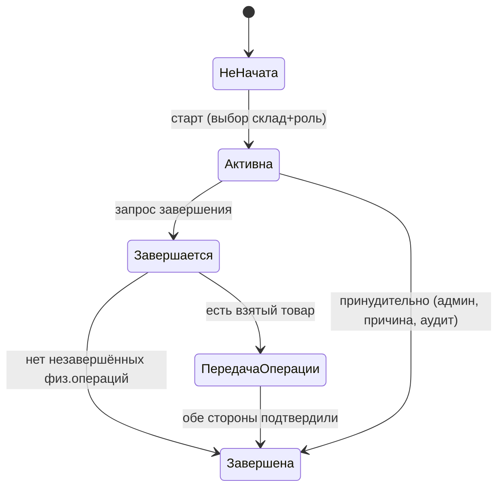
- **Запрещено:** завершить смену при физически взятом товаре без передачи. Активная роль меняется
  только через завершение смены (нельзя две роли одновременно).
- **Остаток:** смена сама по себе остаток не двигает; передача операции переносит владение задачей,
  не сам остаток.
- **Потеря связи/повтор:** старт/финиш идемпотентны по `(userId, active shift)`; повтор не создаёт
  вторую активную смену.

### 2.2. Задача (`WorkflowTask`)

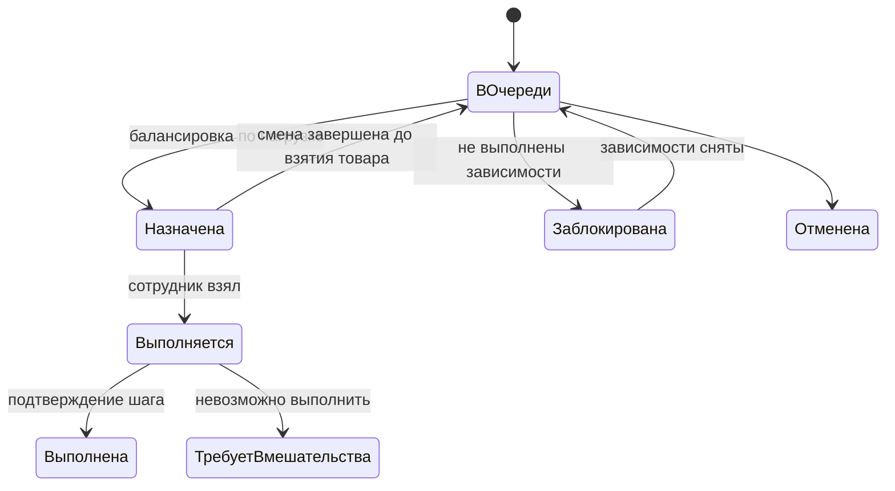
- **Правила очереди:** обычные задачи упорядочены по **времени создания** (в конец списка);
  срочные — **выше** обычных; уже **выполняемая** задача не сбрасывается при появлении срочной;
  после завершения текущей первой предлагается самая срочная доступная; **пропуск срочной — только
  с указанием причины** (в аудит). Уведомлений нет — сотрудник работает со списком.
- **Формулы нагрузки (различны по ролям):** погрузчик — по **числу активных задач** (наименьшее);
  сборщик — по **числу оставшихся строк** в активных заказах (наименьшее); контролёр — по текущей
  нагрузке, единица нагрузки (заказы/строки/прогнозное время) — **открытый вопрос** (§9).
- **Инициатор/предусловия:** назначение — атомарно сотруднику с наименьшей нагрузкой активной
  смены нужной роли/склада. У погрузчика — **одна активная физическая задача**; начать выдачу
  нельзя, пока выполняется другая физическая задача.
- **Блокировки:** зависимости через `TaskDependency`; шаг цепочки открывается после подтверждения
  предыдущего.
- **Остаток:** движение — только при подтверждении физического шага, через ядро.
- **Аудит:** каждое изменение статуса → `logEvent`.
- **Потеря связи/повтор:** взятие/подтверждение идемпотентно по `dedupeKey`; повторный скан не
  двоит движение.

### 2.3. Охлаждение (`CoolingSession`)

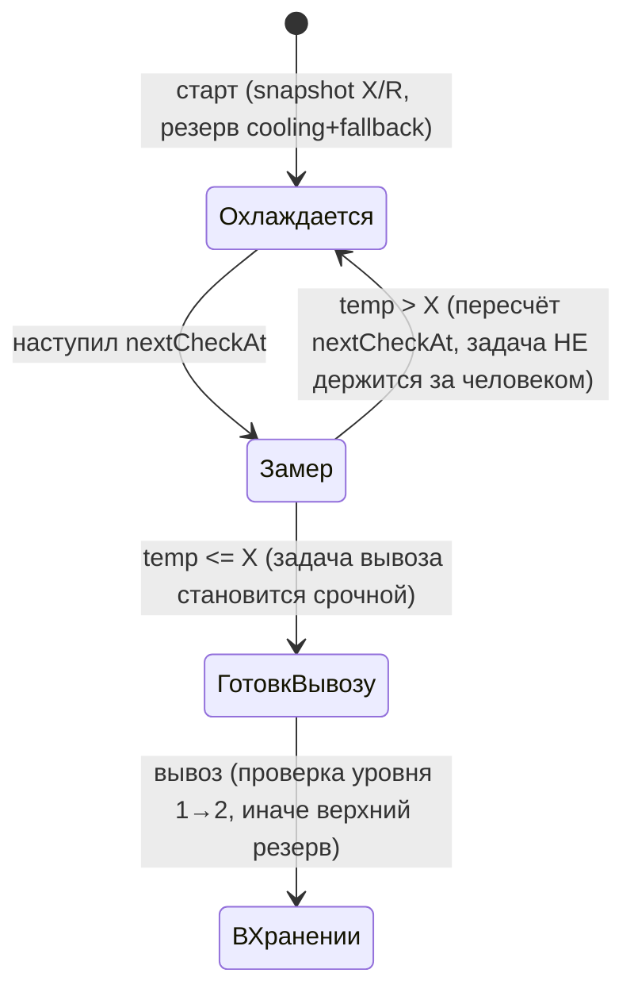
- **Запрещено:** готовая группа не остаётся в охлаждении (переохлаждение). Смена настроек X/R не
  меняет начатую сессию (снимок).
- **Остаток:** перемещения группы — через ядро; ожидание охлаждения не удерживает задачу за
  сотрудником.

### 2.4. Внешний заказ (`ExternalOrder` — канонический владелец)

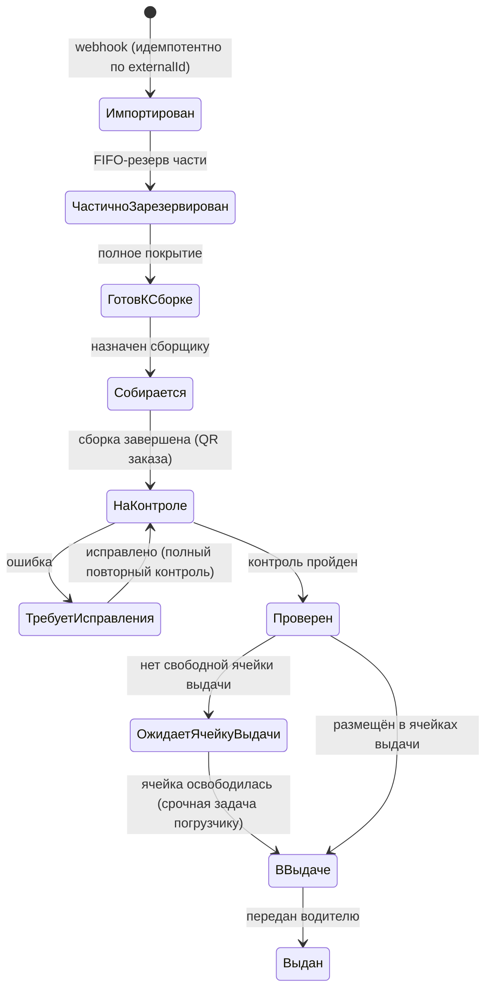
- **Предусловие «ГотовКСборке»:** задача сборщику НЕ создаётся до полного покрытия резервом; если
  покрытие только на верхних уровнях — сначала срочная цепочка погрузчика.
- **«ОжидаетЯчейкуВыдачи»:** если после контроля нет свободной ячейки выдачи, заказ **остаётся в
  зоне контроля** со статусом «Ожидает ячейку выдачи», и задача погрузчику **не создаётся** (нет
  невыполнимой задачи). Перемещение из контроля в выдачу — **срочная** задача; погрузчик сам
  сканирует QR заказа и одну/несколько ячеек и подтверждает «Готово» (авто-назначение ячейки нет).
- **Заблокирован:** нет безопасной цепочки перестановок / нет места → критическое состояние, без
  невыполнимой задачи.
- `PickList` отражает исполнение и не ведёт конкурирующий жизненный цикл.

### 2.5. Группа приёмки / паллета (`HandlingGroup`)

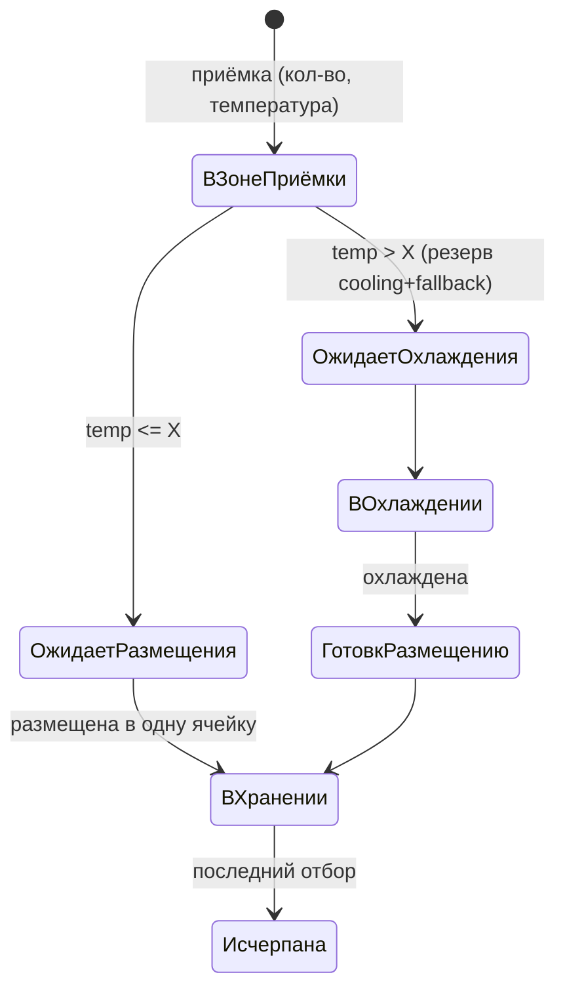
- **Запрещено:** делить паллету при первичном размещении (вся группа в одну ячейку); смешивать две
  группы в одной ячейке; даже одинаковые товары из разных приёмок не объединяются.
- **Предусловие:** товар уже существует в номенклатуре; одно подтверждение приёмки = одна группа.
- **Остаток:** приход `from:null → to:зона приёмки`; все перемещения — через ядро.
- **Аудит:** неизменяемый факт приёмки (автор, время, кол-во, температура) — хранится даже без
  пользовательского документа.
- **Потеря связи/повтор:** приёмка идемпотентна по `dedupeKey` скана — повтор не создаёт вторую группу.

### 2.6. Резерв ячейки

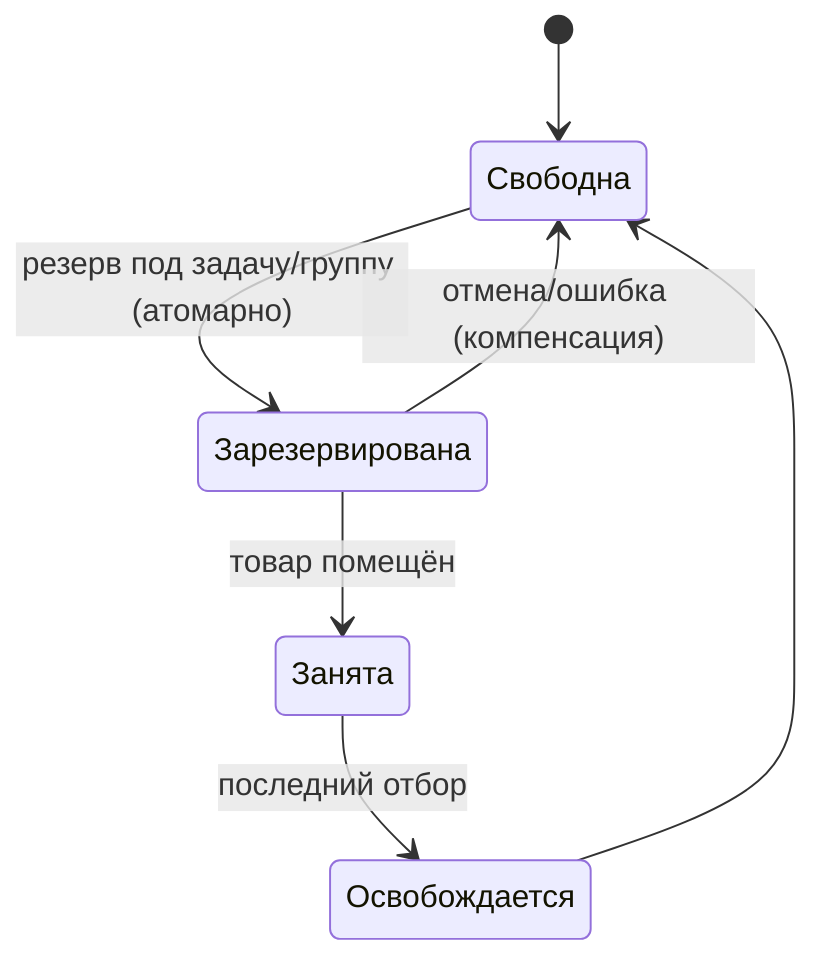
- **Инициатор:** размещение/охлаждение/цепочка. **Блокировка:** активный резерв уникален на `cellId`
  (две задачи не резервируют одну ячейку); буфер — такая же физическая резервируемая ячейка.
- **Предусловие охлаждения:** до помещения резервируются ячейка охлаждения **и** fallback-ячейка
  хранения выше 2-го уровня; перед вывозом — проверка уровня 1→2, иначе используется верхний резерв,
  лишний резерв освобождается.
- **Компенсация:** при отмене задачи резерв ячейки снимается в той же транзакции.

### 2.7. Резерв товара (`StockReservation`, §1.7)

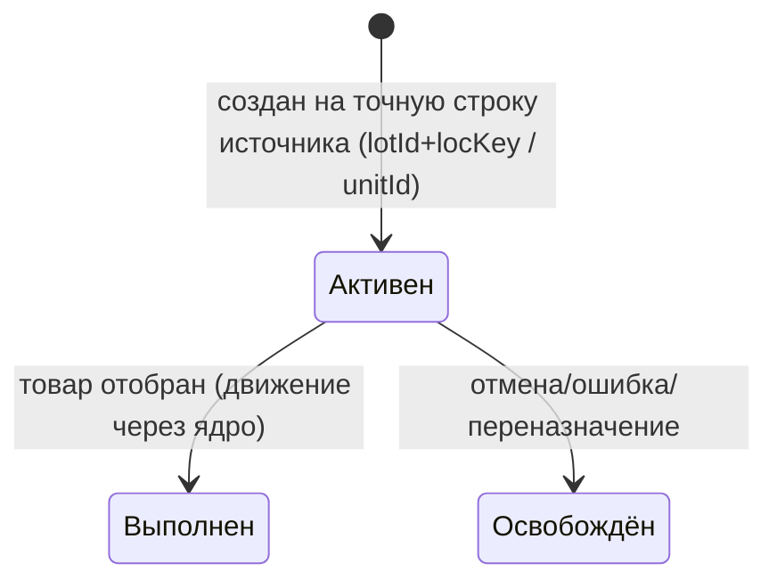
- **Блокировка:** точная строка-источник; проверка `Σ active(lotId,locKey)+new ≤ balance`.
- **Частичное покрытие:** заказу можно создать резервы < потребности; задача сборщику **не**
  создаётся до полного покрытия. **Запрещено:** пересечение резервов сверх остатка строки.
- **Остаток:** сам резерв ledger НЕ двигает (это бронь); движение — при отборе через ядро.
- **Компенсация/идемпотентность:** освобождение при отмене; `dedupeKey` от двойного создания.
- **Открытый вопрос:** перераспределение активного резерва в пользу более срочного заказа (§9).

### 2.8. Сборка

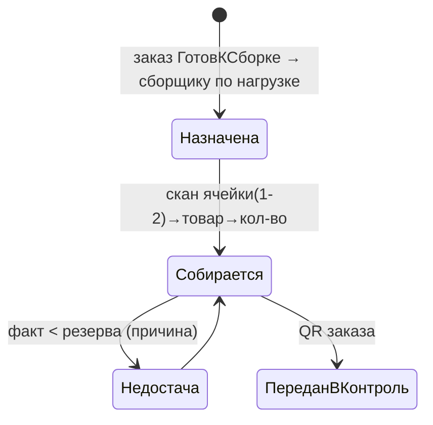
- **Запрещено:** сборщик берёт товар только с уровней 1–2; **излишек не фиксируется** (только
  инвентаризация); срочный заказ не прерывает уже собираемый.
- **Остаток:** отбор — через ядро (`moveUnit`/`applyLotMovement`), списывает резерв §2.7.
- **Потеря связи/повтор:** каждый скан идемпотентен; повтор не увеличивает `qtyPicked` дважды.

### 2.9. Контроль

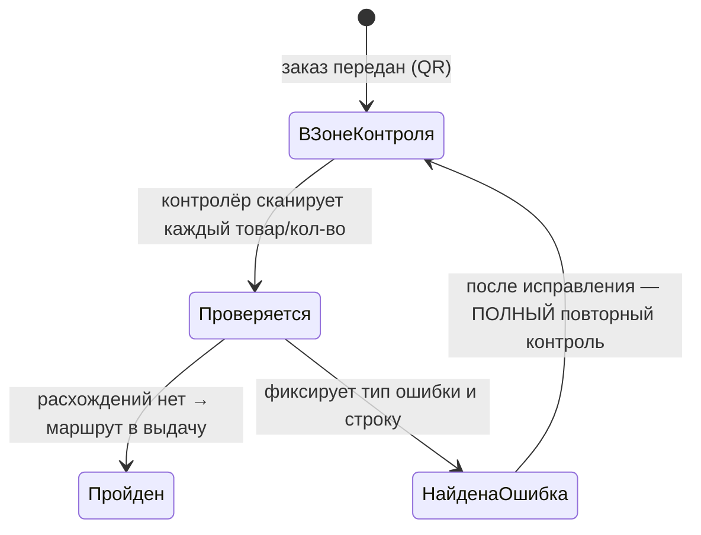
- **Зона контроля** — одна большая системная ячейка. **Запрещено:** частичный повторный контроль
  (после исправления перепроверяется весь заказ).
- **Остаток:** контроль сам по себе не двигает остаток (проверка); ошибки → §2.10.

### 2.10. Исправление (тип `WorkflowTask`)

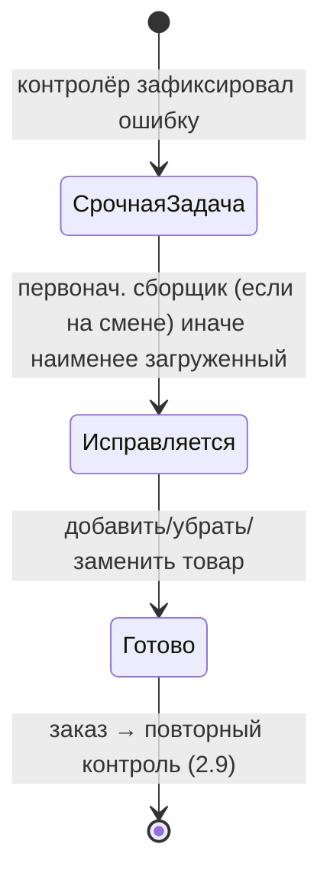
- Коррекция — **тип общей задачи** (в балансировке), не отдельная очередь. **Остаток:** возврат
  лишнего/неправильного товара — в исходную группу или зону расхождений **через ядро/инвентаризацию**,
  без прямой правки остатка. **Аудит:** автор, причина, исходное/новое кол-во.

### 2.11. Размещение в выдаче

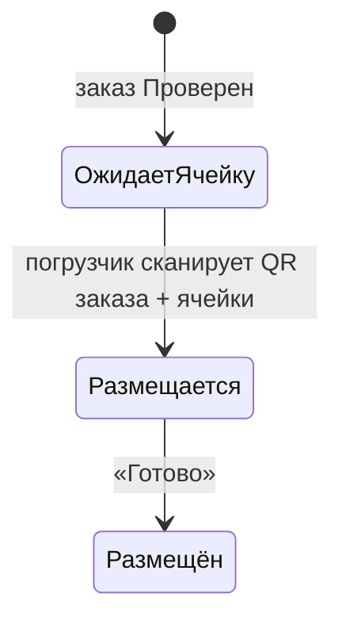
- **Запрещено:** авто-назначение ячейки; смешивание разных заказов в одной ячейке выдачи. Один
  заказ **может** занимать несколько ячеек. Нет свободной ячейки → заказ в «ОжидаетЯчейкуВыдачи»
  (§2.4), задача не создаётся. Перемещение контроль→выдача — срочное.
- **Остаток:** перемещение в ячейки выдачи — через ядро.

### 2.12. Выдача водителю (`Shipment`)

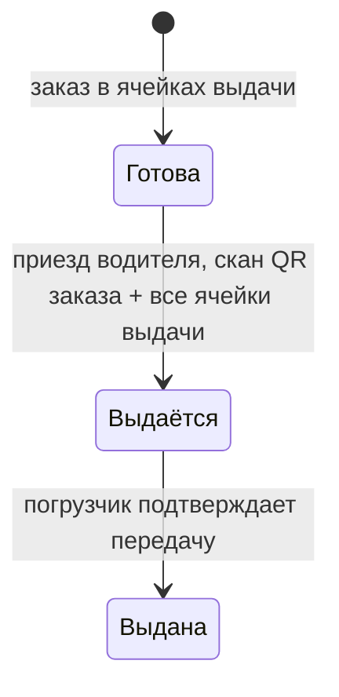
- **Предусловие:** погрузчик не начинает выдачу, пока выполняет другую физическую задачу.
  **v1:** подтверждение водителем не требуется (открытый вопрос §9).
- **Остаток:** расход `→ null` (внешний мир) через ядро; заказ → «Выдан».
- **Потеря связи/повтор:** подтверждение идемпотентно по заказу — повтор не двоит расход.

---

## 3. Конкурентность и идемпотентность

| Проблема | Механизм |
|---|---|
| Одну задачу не берут двое | атомарный переход `Назначена→Выполняется` условным `updateMany(where status=…)`; `count!==1` → отказ (паттерн ядра `stock.ts:88-92`) |
| Одну ячейку не резервируют двое | резерв ячейки транзакцией + уникальность активного резерва на `cellId` |
| Один lot — частями в разные заказы | **НЕ уникальность по `lotId`**; транзакционная блокировка источника + `Σ active + new ≤ balance` |
| Назначение по наименьшей нагрузке | подсчёт нагрузки и присвоение в одной транзакции с блокировкой строки исполнителя |
| Срочная не прерывает активную | срочность влияет на выбор следующей задачи, не трогает `Выполняется` |
| Зависимая цепочка | пошаговая блокировка через `TaskDependency`; следующий шаг — после подтверждения |
| Повтор скана | идемпотентный `dedupeKey` операции → повтор не двоит движение |
| Повтор webhook заказа | идемпотентность по `@@unique([companyId, externalId])` |
| Уровень транзакции | документные операции — в одной `prisma.$transaction`; для резерва — блокировка источника (условный decrement или `FOR UPDATE`) |

---

## 4. Остаток, ядро и системные зоны

- Все новые движения — через `applyLotMovement`/`moveUnit` (`stock.ts:54/114`).
- **Системные зоны** (приёмка, контроль, расхождения, буфер) — как места хранения. Текущий `locKey`
  поддерживает `C:/W:/E:/EP:` (`stock.ts:21-32`). Кандидат: добавить системный тип места (напр.
  `Z:<zoneId>`) и соответствующий `Loc` — это **обратно-совместимое расширение API ядра**, требует
  отдельного обоснования и тестов (см. принцип 3).
- **Обходы ядра (AUDIT §4) — план приведения:**
  1. приёмка units (`supplier-orders.ts:481/496`) → провести через `moveUnit` (или обосновать
     специализированный «приходный» путь в ядре);
  2. удаление приёмки (`:671/674`, удаление ledger) → заменить компенсирующим обратным движением
     через ядро (append-only), а не физическим удалением строк;
  3. off-ledger резерв (`picklists.ts:384/637/711`) → перенести в `StockReservation` (§1.7).
- Инвентаризация уже корректна (`inventory.ts:279-331`) — эталон для «зоны расхождений».

---

## 5. Tenant-security

- Каждая новая модель: `companyId` + scoped queries (`scoped()` `src/lib/tenant.ts`) + уникальные
  ключи с `companyId` (`ExternalOrder @@unique([companyId, externalId])`,
  `UserRole @@unique([companyId, userId, role])` и т.д.).
- **Шлюз Этапа 4:** решения по `User.phone/email` per-tenant и host-enforcement — до реализации
  ролей/смен.
- Realtime: события уже фильтруются по `companyId`/роли (`api/realtime/route.ts:20-31`); новые типы
  задач добавить в фильтр. Учесть одно-процессность шины (`realtime.ts:3-12`) при масштабировании.

---

## 6. Поэтапная миграция

> Названия и состав — предварительные; финальны после выбора вариантов §1. Additive и cutover —
> разные классы (принцип 7).

Для КАЖДОГО этапа обязательно: граница функциональности · schema diff (на уровне сущностей) ·
backfill · feature flag · dual-read/dual-write (если нужен) · совместимость со старыми данными ·
тесты · staging-сценарии · метрики · стоп-условия · rollback кода · restore БД при несовместимой
forward-only миграции · критерии допуска на prod (через `deploy-prod.sh`, бэкап-гейт).

| Этап | Граница | Ключевые сущности (гипотезы) | Класс | Зависимости |
|---|---|---|---|---|
| **A. Основание** | роли, смены, зоны/уровни ячеек, настройки X/R/N — без изменения движения товара | `UserRole`, `WorkShift`, зоны (§1.3), эволюция settings | additive | **шлюз Этапа 4** |
| **B. Очередь задач** | `WorkflowTask` на ОДНОМ безопасном процессе (напр. плановое опускание) | `WorkflowTask`, `TaskDependency` | additive + feature flag | A |
| **C. Приёмка+охлаждение** | группа/паллета, температура, cooling | `HandlingGroup`, `CoolingSession`, `TemperatureMeasurement` | additive; dual-write с текущей приёмкой | A |
| **D. Хранение** | уровни, резерв ячеек, плановые/срочные цепочки, буфер | `StockReservation` (ячейка), цепочки задач | additive | B, C |
| **E. Внешние заказы** | импорт, идемпотентность, FIFO-резервы товара | `ExternalOrder(+Line)`, `StockReservation` (товар) | additive | B, D |
| **F. Сборка по очереди** | сборка из очереди, привязка к заказу/резерву | адаптация `PickList*` | additive + feature flag; dual-read | E |
| **G. Контроль+выдача** | контроль, исправление (тип задачи), мультиячейка выдачи, водитель | `ControlCheck`, `Shipment` | additive | F |
| **H. Отключение legacy-путей** | перевод потребителей на новые пути; push отключается **per-workflow только после cutover** процесса | — | dual→single | A–G |
| **I. Cleanup** | удаление legacy-полей/статусов/write-path | — | **cutover (не additive)** — только после наблюдения и отдельного решения | H |

**Пример детализации этапа A:**
- schema diff: +`UserRole`, +`WorkShift`, +зоны (по выбранному варианту), +поля settings X/R/N.
- backfill: `User.role` → `UserRole`; `Cell.isStaging` → зоны **по карте фактического
  использования** (не автоматически).
- feature flag: новые роли/смены не активны в UI до готовности; старые гварды работают (dual-read
  `session.role` и активная роль).
- совместимость: старый вход и `session.role` продолжают работать в переходный период.
- тесты: миграция ролей на копии; смена-переходы; запрет завершения при взятом товаре.
- staging: прогон seed rostagro + сценарии смен.
- метрики: число активных смен, ошибки назначения.
- стоп-условия: расхождение прав до/после; сбой backfill.
- rollback кода: откат релиза (роли не активны) безопасен, т.к. additive.
- restore БД: только если forward-only миграция несовместима — из бэкапа по [RESTORE.md](RESTORE.md).
- допуск на prod: зелёный staging + бэкап-гейт `deploy-prod.sh` + команда владельца.

**Детализация этапов B–I** (формат: backfill · feature flag · тесты · staging · метрики ·
стоп-условия · rollback/restore · допуск). Общее для всех: additive-миграция forward-only; rollback
кода — **проверенный revert-коммит в `main` + push + deploy** (см. §8), НЕ checkout; restore БД —
только при несовместимой миграции ([RESTORE.md](RESTORE.md)); допуск на prod = зелёный staging +
бэкап-гейт + команда владельца.

- **B. Очередь задач (`WorkflowTask`+`TaskDependency`), 1 процесс.**
  backfill: нет (новая таблица, задачи создаются вперёд) · flag: `workflowTasks` включает очередь
  только для выбранного процесса (напр. плановое опускание) · тесты: назначение по нагрузке,
  срочность не прерывает активную, граф зависимостей, идемпотентный `dedupeKey` · staging: 2
  сотрудника не берут одну задачу · метрики: длина очереди, зависшие задачи, время назначения ·
  стоп: двойное взятие/зависания · rollback: flag off → старый ручной процесс.
- **C. Приёмка+охлаждение (`HandlingGroup`, `CoolingSession`, `TemperatureMeasurement`; X в company,
  R warehouse-scoped).** backfill: существующие `Receipt/Lot` не переносятся в группы задним числом
  (только новые приёмки) — dual-write для новых · flag: `groupReceiving` · тесты: снимок X/R,
  пересчёт замера, срочный вывоз, «одна группа — одна ячейка» · staging: приёмка выше/ниже порога X ·
  метрики: просроченные замеры, группы «застряли в охлаждении» · стоп: рассинхрон группа↔баланс ·
  rollback: flag off → текущая приёмка.
- **D. Хранение (уровни, `StockReservation` ячейки, цепочки, буфер).** backfill: `Cell.level`
  проставить по данным склада; буфер-ячейки помечаются · flag: `levelPlacement` · тесты: выбор
  1→2→выше, цепочки низ→буфер→низ и их откат, резерв ячейки без гонки · staging: параллельные
  перестановки · метрики: заблокированные цепочки, нет-места события · стоп: две задачи на одну
  ячейку · rollback: flag off → размещение без уровней.
- **E. Внешние заказы (`ExternalOrder(+Line)`, FIFO-резерв товара).** backfill: нет (импорт вперёд) ·
  flag: `externalOrders` · тесты: идемпотентность webhook (`@@unique[companyId,externalId]`), FIFO
  со стабильным tie-break, частичное покрытие, блокировка строки-источника · staging: повтор webhook,
  параллельные резервы одного lot в 2 заказа · метрики: ошибки импорта (dead-letter), покрытие
  резервом · стоп: двойной резерв/двойной импорт · rollback: flag off → импорт выключен.
- **F. Сборка по очереди (адаптация `PickList*`).** backfill: открытые `PickList` дособираются
  старым путём (dual-read) · flag: `queuePicking` · тесты: скан ячейка→товар→кол-во, недостача без
  излишка, списание резерва §2.7 · staging: сборка заказа из нескольких групп/ячеек · метрики:
  время сборки, недостачи · стоп: расхождение резерв↔отбор · rollback: flag off → текущая сборка.
- **G. Контроль+выдача (`ControlCheck`, коррекция как задача, `Shipment`, мультиячейка).** backfill:
  нет · flag: `controlAndShipment` · тесты: полный повторный контроль после исправления, возврат
  товара через инвентаризацию, «ОжидаетЯчейкуВыдачи», один заказ→N ячеек · staging: ошибка→
  исправление→повторный контроль→выдача · метрики: доля заказов с ошибками, ожидание ячейки выдачи ·
  стоп: смешение заказов в ячейке выдачи · rollback: flag off → текущая выдача `Issue`.
- **H. Отключение legacy-путей.** backfill: перевод оставшихся потребителей на новые пути; **push
  отключается per-workflow только после cutover соответствующего процесса** (не глобально) · flag:
  снятие dual-read/-write по одному процессу · тесты: отсутствие обращений к старым путям · staging:
  прогон всех сценариев без legacy · метрики: обращения к legacy = 0 · стоп: ненулевой legacy-трафик ·
  rollback: вернуть dual-путь.
- **I. Cleanup (cutover, НЕ additive).** backfill: финальная сверка данных · тесты: полный regress +
  сверка ledger до/после удаления полей · staging: обязательный прогон на копии prod-данных · стоп:
  любое расхождение остатков · rollback: **невозможен откатом кода** (удаление схемы) → только
  restore БД из бэкапа. **Выполняется только после периода наблюдения и отдельного решения владельца.**

---

## 7. Тестовая стратегия

- **Ядро (эталон):** расширить `scripts/verify-stock.ts` (сейчас: минус-защита `:103`,
  сверка ledger↔баланс `:256`) на новые `docType`/места и на приведённые к ядру обходы.
- **Конкурентность (новое, обязательно для «сохранности»):** параллельные резервы одного lot;
  параллельное взятие одной задачи/ячейки/группы; идемпотентность скана и webhook.
- **Сценарные:** охлаждение (пересчёт, снимок X/R, срочный вывоз); FIFO (старейшая группа, строка
  из нескольких групп, частичное покрытие); цепочки перестановок и их откат; смена (передача
  незавершённой операции).
- **Совместимость миграций:** backfill на копии данных + сверка ledger до/после; проверка, что
  старые `Receipt/Lot/PickList/Issue/Cell` продолжают читаться в переходный период.
- **Сквозные/мобайл/SSE:** существующие `verify-http.mjs`, `verify-mobile.mjs`, `verify-realtime.mjs`
  дополнить новыми экранами.

Критерий «сохранность остатков доказана» (AUDIT §7) — **ещё НЕ выполнен**. На текущем этапе
**спроектированы** карта write-path (AUDIT §4) и правила миграции обходов (§4 этого документа).
Тестов конкурентности пока **нет**. Доказательство появится **только после реализации** этих
правил и **успешного прогона** тестов конкурентности на staging. До этого ни один этап, меняющий
движение товара, не считается безопасным для prod.

---

## 8. Rollback и restore

- **Rollback кода:** deploy-скрипты требуют чистого дерева и **`main == origin/main`** (guard'ы в
  `scripts/prod/deploy-*.sh`), поэтому откат через `git checkout <старый коммит>` **не пройдёт**
  (detached HEAD ≠ origin/main). Правильный путь: **`git revert <плохой коммит>` → commit в `main`
  → `git push origin main` → `deploy-staging.sh` → (по команде) `deploy-prod.sh`.** На сервере `.git`
  нет — откат только через выкатку (см. [OPERATIONS.md](OPERATIONS.md)).
- **Forward-only:** откат кода НЕ откатывает схему. Если релиз содержал несовместимую миграцию —
  восстановление схемы/данных только `restore` из бэкапа ([RESTORE.md](RESTORE.md)), с отдельным
  подтверждением.
- **Дизайн миграций в стиле expand/contract** снижает потребность в restore: сначала аддитивно
  (nullable-колонка/новая таблица/dual-write), удаление старого — отдельным поздним cutover-этапом.

---

## 9. Открытые вопросы (НЕ закрыты предположениями)

См. [ROSTAGRO_WORKFLOW_AUDIT.md](ROSTAGRO_WORKFLOW_AUDIT.md) §10 — 10 бизнес-вопросов + 4
технических (обходы ядра, per-tenant identity/Этап 4, масштабирование realtime, маппинг
`isStaging`). До отдельного решения владельца соответствующие части не реализуются.

## 10. Что НЕ сделано в этом документе (намеренно)

- Не выбрана окончательная схема (таблицы/enum) — только сравнение вариантов.
- Не создан Prisma-код, миграции, SQL, PoC.
- Не изменены `PROJECT_CONTEXT.md`/`ROADMAP.md` (предложение — в финальном отчёте задачи).
- Реализация ролей/смен заблокирована шлюзом Этапа 4.
